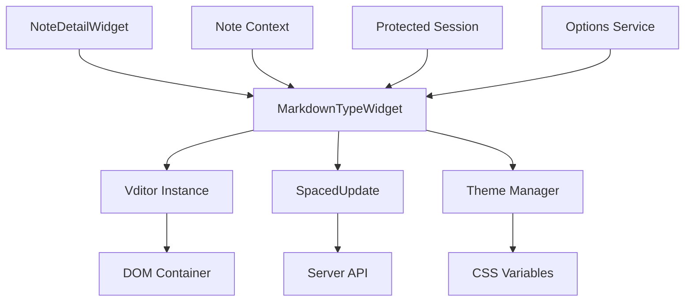

# Vditor Markdown Editor v1.1 - Design Document

## Overview

The Vditor Markdown Editor v1.1 is a TypeScript-based implementation that integrates the Vditor library into Trilium Notes as a new note type. The design follows Trilium's existing TypeWidget architecture while providing a modern, feature-rich markdown editing experience with instant rendering capabilities.

## Architecture

### High-Level Architecture

```
┌─────────────────────────────────────────────────────────────┐
│                    Trilium Frontend                         │
├─────────────────────────────────────────────────────────────┤
│  NoteDetailWidget                                           │
│  ├── getWidgetType() → "markdown"                          │
│  └── typeWidgetClasses["markdown"] → MarkdownTypeWidget    │
├─────────────────────────────────────────────────────────────┤
│  MarkdownTypeWidget (extends TypeWidget)                   │
│  ├── Vditor Instance Management                            │
│  ├── Content Synchronization                               │
│  ├── Auto-save Integration                                 │
│  └── Theme & State Management                              │
├─────────────────────────────────────────────────────────────┤
│  Vditor Library                                            │
│  ├── Instant Rendering (IR) Mode                          │
│  ├── Toolbar & UI Components                              │
│  └── Markdown Processing Engine                           │
└─────────────────────────────────────────────────────────────┘
```

### Component Relationships



## Components and Interfaces

### Core Components

#### 1. MarkdownTypeWidget Class

**Purpose**: Main component that manages the Vditor editor lifecycle and integrates with Trilium's note system.

**Key Properties**:
- `vditor?: IVditor` - The Vditor editor instance
- `$container: JQuery<HTMLElement>` - DOM container for the editor
- `currentNoteId?: string` - Tracks the currently loaded note
- `isVditorReady: boolean` - Indicates if the editor is ready for operations

**Key Methods**:
- `initVditor(): Promise<void>` - Asynchronously initializes the Vditor editor
- `doRefresh(note: FNote): Promise<void>` - Loads note content into the editor
- `safeSetValue(content: string): Promise<void>` - Safely sets editor content with retry logic
- `updateReadOnlyMode(): Promise<void>` - Updates editor state based on note permissions

#### 2. Vditor Configuration

**Editor Configuration**:
```typescript
{
    height: "100%",
    mode: "ir", // Instant Rendering mode
    theme: isDarkTheme ? "dark" : "classic",
    toolbar: [
        "headings", "bold", "italic", "strike", "|",
        "list", "ordered-list", "check", "|", 
        "quote", "line", "code", "table", "|",
        "undo", "redo", "|",
        "edit-mode", "both", "preview"
    ],
    counter: { enable: true, type: "text" },
    cache: { enable: false }
}
```

#### 3. Auto-Save Integration

**SpacedUpdate Configuration**:
- Debounce delay: 500ms (configurable)
- Triggers on content change events
- Integrates with Trilium's protected session handling
- Respects database readonly mode

### Data Models

#### Note Content Structure
```typescript
interface MarkdownNoteData {
    content: string; // Raw markdown content
}
```

#### Vditor State Management
```typescript
interface VditorState {
    isReady: boolean;
    currentContent: string;
    isReadOnly: boolean;
    theme: 'light' | 'dark';
}
```

## Error Handling

### Initialization Error Recovery

1. **DOM Readiness Check**: Verify container element is connected to DOM
2. **Retry Mechanism**: Up to 20 retries with 100ms intervals for content setting
3. **Graceful Degradation**: Show error message if initialization fails completely
4. **Resource Cleanup**: Proper disposal of failed instances

### Content Setting Error Handling

```typescript
private async safeSetValue(content: string) {
    let retries = 0;
    const maxRetries = 20;
    
    while (retries < maxRetries) {
        try {
            if ((this.vditor as any).vditor?.ir) {
                this.vditor.setValue(content);
                return;
            }
        } catch (error) {
            // Continue retrying
        }
        
        retries++;
        await new Promise(resolve => setTimeout(resolve, 100));
    }
    
    console.error("Failed to set vditor value after retries");
}
```

### Error Recovery Strategies

1. **Initialization Failure**: Attempt to reinitialize editor
2. **Content Loading Error**: Retry with exponential backoff
3. **Theme Change Error**: Fallback to default theme
4. **Save Operation Error**: Queue retry and notify user

## Testing Strategy

### Unit Testing Approach

#### Test Categories

1. **Component Lifecycle Tests**
   - Editor initialization and cleanup
   - Note switching scenarios
   - Error handling paths

2. **Content Management Tests**
   - Content loading and saving
   - Auto-save functionality
   - Read-only mode behavior

3. **Integration Tests**
   - Trilium note system integration
   - Theme switching
   - Protected notes handling

#### Mock Strategy

```typescript
// Vditor Mock for Testing
vi.mock("vditor", () => ({
    default: vi.fn().mockImplementation(() => ({
        setValue: vi.fn(),
        getValue: vi.fn(() => ""),
        focus: vi.fn(),
        destroy: vi.fn(),
        disabled: vi.fn(),
        enable: vi.fn()
    }))
}));
```

### Performance Testing

#### Key Metrics
- **Initialization Time**: < 2 seconds
- **Content Loading Time**: < 500ms for typical documents
- **Memory Usage**: Proper cleanup verification
- **Auto-save Frequency**: Respects debounce limits

#### Load Testing Scenarios
- Large documents (1MB+ markdown content)
- Rapid note switching
- Extended editing sessions
- Multiple concurrent instances

## Implementation Details

### File Structure
```
apps/client/src/widgets/type_widgets/
├── markdown.ts                 # Main implementation
├── markdown.spec.ts           # Unit tests
└── markdown_simple.ts         # Fallback implementation
```

### Dependencies
- **vditor**: ^3.10.4 - Main editor library
- **vditor/dist/index.css**: Editor styling
- Trilium's existing TypeWidget infrastructure

### CSS Integration
- Automatic theme detection via `document.body.classList`
- CSS custom properties integration for consistent styling
- Responsive design for different screen sizes

### Keyboard Shortcuts
- Standard editing shortcuts (Ctrl+Z, Ctrl+Y, Ctrl+S)
- Markdown-specific shortcuts (Ctrl+B for bold, etc.)
- Trilium navigation shortcuts compatibility

## Security Considerations

### Content Sanitization
- Vditor handles markdown sanitization internally
- Integration with Trilium's protected notes encryption
- XSS prevention through proper content handling

### Data Protection
- Auto-save respects protected session requirements
- Content is encrypted when note is marked as protected
- No sensitive data stored in browser cache

## Performance Optimizations

### Lazy Loading
- Vditor library loaded only when needed
- CSS imported asynchronously
- Editor initialization deferred until note access

### Memory Management
- Proper cleanup of Vditor instances
- Event listener removal on component destruction
- DOM element cleanup

### Caching Strategy
- Disabled Vditor internal caching (conflicts with Trilium's system)
- Leverages Trilium's existing note caching
- Minimal memory footprint for inactive editors

## Deployment Considerations

### Browser Compatibility
- Modern browsers supporting ES2020+
- Vditor's browser requirements
- Graceful degradation for unsupported features

### Bundle Size Impact
- Vditor adds ~500KB to bundle size
- Lazy loading minimizes initial load impact
- Tree shaking for unused features

### Configuration Management
- Theme detection from Trilium settings
- Editor preferences integration
- Toolbar customization support

This design provides a robust, scalable foundation for the Vditor Markdown Editor v1.1, ensuring seamless integration with Trilium Notes while delivering a modern editing experience.