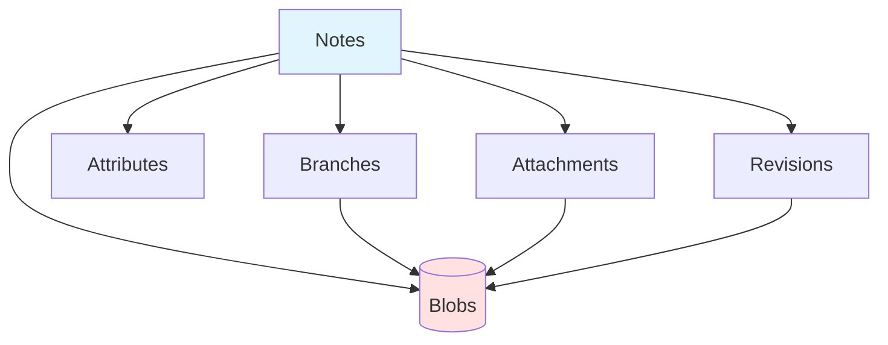

# Trilium Database Architecture

> **Related:** [ARCHITECTURE.md](ARCHITECTURE.md) | [Database Schema](Developer%20Guide/Developer%20Guide/Development%20and%20architecture/Database/)

## Overview

Trilium uses **SQLite** as its embedded database engine, providing a reliable, file-based storage system that requires no separate database server. The database stores all notes, their relationships, metadata, and configuration.

## Database File

**Location:**
- Desktop: `~/.local/share/trilium-data/document.db` (Linux/Mac) or `%APPDATA%/trilium-data/document.db` (Windows)
- Server: Configured via `TRILIUM_DATA_DIR` environment variable
- Docker: Mounted volume at `/home/node/trilium-data/`

**Characteristics:**
- Single-file database
- Embedded (no server required)
- ACID compliant
- Cross-platform
- Supports up to 281 TB database size
- Efficient for 100k+ notes

## Database Driver

**Library:** `better-sqlite3`

**Why better-sqlite3:**
- Native performance (C++ bindings)
- Synchronous API (simpler code)
- Prepared statements
- Transaction support
- Type safety

**Usage:**
```typescript
// apps/server/src/services/sql.ts
import Database from 'better-sqlite3'

const db = new Database('document.db')
const stmt = db.prepare('SELECT * FROM notes WHERE noteId = ?')
const note = stmt.get(noteId)
```

## Schema Overview

Schema location: `apps/server/src/assets/db/schema.sql`

**Entity Tables:**
- `notes` - Core note data
- `branches` - Tree relationships
- `attributes` - Metadata (labels/relations)
- `revisions` - Version history
- `attachments` - File attachments
- `blobs` - Binary content storage

**System Tables:**
- `options` - Application configuration
- `entity_changes` - Change tracking for sync
- `recent_notes` - Recently accessed notes
- `etapi_tokens` - API authentication tokens
- `user_data` - User credentials
- `sessions` - Web session storage

## Entity Tables

### Notes Table

```sql
CREATE TABLE notes (
    noteId TEXT NOT NULL PRIMARY KEY,
    title TEXT NOT NULL DEFAULT "note",
    isProtected INT NOT NULL DEFAULT 0,
    type TEXT NOT NULL DEFAULT 'text',
    mime TEXT NOT NULL DEFAULT 'text/html',
    blobId TEXT DEFAULT NULL,
    isDeleted INT NOT NULL DEFAULT 0,
    deleteId TEXT DEFAULT NULL,
    dateCreated TEXT NOT NULL,
    dateModified TEXT NOT NULL,
    utcDateCreated TEXT NOT NULL,
    utcDateModified TEXT NOT NULL
);

-- Indexes for performance
CREATE INDEX IDX_notes_title ON notes (title);
CREATE INDEX IDX_notes_type ON notes (type);
CREATE INDEX IDX_notes_dateCreated ON notes (dateCreated);
CREATE INDEX IDX_notes_dateModified ON notes (dateModified);
CREATE INDEX IDX_notes_utcDateModified ON notes (utcDateModified);
CREATE INDEX IDX_notes_blobId ON notes (blobId);
```

**Field Descriptions:**

| Field | Type | Description |
|-------|------|-------------|
| `noteId` | TEXT | Unique identifier (UUID or custom) |
| `title` | TEXT | Note title (displayed in tree) |
| `isProtected` | INT | 1 if encrypted, 0 if not |
| `type` | TEXT | Note type: text, code, file, image, etc. |
| `mime` | TEXT | MIME type: text/html, application/json, etc. |
| `blobId` | TEXT | Reference to content in blobs table |
| `isDeleted` | INT | Soft delete flag |
| `deleteId` | TEXT | Unique delete operation ID |
| `dateCreated` | TEXT | Creation date (local timezone) |
| `dateModified` | TEXT | Last modified (local timezone) |
| `utcDateCreated` | TEXT | Creation date (UTC) |
| `utcDateModified` | TEXT | Last modified (UTC) |

**Note Types:**
- `text` - Rich text with HTML
- `code` - Source code
- `file` - Binary file
- `image` - Image file
- `search` - Saved search
- `render` - Custom HTML rendering
- `relation-map` - Relationship diagram
- `canvas` - Excalidraw drawing
- `mermaid` - Mermaid diagram
- `book` - Container for documentation
- `web-view` - Embedded web page
- `mindmap` - Mind map
- `geomap` - Geographical map

### Branches Table

```sql
CREATE TABLE branches (
    branchId TEXT NOT NULL PRIMARY KEY,
    noteId TEXT NOT NULL,
    parentNoteId TEXT NOT NULL,
    notePosition INTEGER NOT NULL,
    prefix TEXT,
    isExpanded INTEGER NOT NULL DEFAULT 0,
    isDeleted INTEGER NOT NULL DEFAULT 0,
    deleteId TEXT DEFAULT NULL,
    utcDateModified TEXT NOT NULL
);

-- Indexes
CREATE INDEX IDX_branches_noteId_parentNoteId ON branches (noteId, parentNoteId);
CREATE INDEX IDX_branches_parentNoteId ON branches (parentNoteId);
```

**Field Descriptions:**

| Field | Type | Description |
|-------|------|-------------|
| `branchId` | TEXT | Unique identifier for this branch |
| `noteId` | TEXT | Child note ID |
| `parentNoteId` | TEXT | Parent note ID |
| `notePosition` | INT | Sort order among siblings |
| `prefix` | TEXT | Optional prefix text (e.g., "Chapter 1:") |
| `isExpanded` | INT | Tree expansion state |
| `isDeleted` | INT | Soft delete flag |
| `deleteId` | TEXT | Delete operation ID |
| `utcDateModified` | TEXT | Last modified (UTC) |

**Key Concepts:**
- **Cloning:** A note can have multiple branches (multiple parents)
- **Position:** Siblings ordered by `notePosition`
- **Prefix:** Display text before note title in tree
- **Soft Delete:** Allows sync before permanent deletion

### Attributes Table

```sql
CREATE TABLE attributes (
    attributeId TEXT NOT NULL PRIMARY KEY,
    noteId TEXT NOT NULL,
    type TEXT NOT NULL,
    name TEXT NOT NULL,
    value TEXT DEFAULT '' NOT NULL,
    position INT DEFAULT 0 NOT NULL,
    utcDateModified TEXT NOT NULL,
    isDeleted INT NOT NULL,
    deleteId TEXT DEFAULT NULL,
    isInheritable INT DEFAULT 0 NULL
);

-- Indexes
CREATE INDEX IDX_attributes_name_value ON attributes (name, value);
CREATE INDEX IDX_attributes_noteId ON attributes (noteId);
CREATE INDEX IDX_attributes_value ON attributes (value);
```

**Field Descriptions:**

| Field | Type | Description |
|-------|------|-------------|
| `attributeId` | TEXT | Unique identifier |
| `noteId` | TEXT | Note this attribute belongs to |
| `type` | TEXT | 'label' or 'relation' |
| `name` | TEXT | Attribute name |
| `value` | TEXT | Attribute value (text for labels, noteId for relations) |
| `position` | INT | Display order |
| `utcDateModified` | TEXT | Last modified (UTC) |
| `isDeleted` | INT | Soft delete flag |
| `deleteId` | TEXT | Delete operation ID |
| `isInheritable` | INT | Inherited by child notes |

**Attribute Types:**

**Labels** (key-value pairs):
```sql
-- Example: #priority=high
INSERT INTO attributes (attributeId, noteId, type, name, value)
VALUES ('attr1', 'note123', 'label', 'priority', 'high')
```

**Relations** (links to other notes):
```sql
-- Example: ~author=[[noteId]]
INSERT INTO attributes (attributeId, noteId, type, name, value)
VALUES ('attr2', 'note123', 'relation', 'author', 'author-note-id')
```

**Special Attributes:**
- `#run=frontendStartup` - Execute script on frontend load
- `#run=backendStartup` - Execute script on backend load
- `#customWidget` - Custom widget implementation
- `#iconClass` - Custom tree icon
- `#cssClass` - CSS class for note
- `#sorted` - Auto-sort children
- `#hideChildrenOverview` - Don't show child list

### Revisions Table

```sql
CREATE TABLE revisions (
    revisionId TEXT NOT NULL PRIMARY KEY,
    noteId TEXT NOT NULL,
    type TEXT DEFAULT '' NOT NULL,
    mime TEXT DEFAULT '' NOT NULL,
    title TEXT NOT NULL,
    isProtected INT NOT NULL DEFAULT 0,
    blobId TEXT DEFAULT NULL,
    utcDateLastEdited TEXT NOT NULL,
    utcDateCreated TEXT NOT NULL,
    utcDateModified TEXT NOT NULL,
    dateLastEdited TEXT NOT NULL,
    dateCreated TEXT NOT NULL
);

-- Indexes
CREATE INDEX IDX_revisions_noteId ON revisions (noteId);
CREATE INDEX IDX_revisions_utcDateCreated ON revisions (utcDateCreated);
CREATE INDEX IDX_revisions_utcDateLastEdited ON revisions (utcDateLastEdited);
CREATE INDEX IDX_revisions_blobId ON revisions (blobId);
```

**Revision Strategy:**
- Automatic revision created on note modification
- Configurable interval (default: daily max)
- Stores complete note snapshot
- Allows reverting to previous versions
- Can be disabled with `#disableVersioning`

### Attachments Table

```sql
CREATE TABLE attachments (
    attachmentId TEXT NOT NULL PRIMARY KEY,
    ownerId TEXT NOT NULL,
    role TEXT NOT NULL,
    mime TEXT NOT NULL,
    title TEXT NOT NULL,
    isProtected INT NOT NULL DEFAULT 0,
    position INT DEFAULT 0 NOT NULL,
    blobId TEXT DEFAULT NULL,
    dateModified TEXT NOT NULL,
    utcDateModified TEXT NOT NULL,
    utcDateScheduledForErasureSince TEXT DEFAULT NULL,
    isDeleted INT NOT NULL,
    deleteId TEXT DEFAULT NULL
);

-- Indexes
CREATE INDEX IDX_attachments_ownerId_role ON attachments (ownerId, role);
CREATE INDEX IDX_attachments_blobId ON attachments (blobId);
```

**Attachment Roles:**
- `file` - Regular file attachment
- `image` - Image file
- `cover-image` - Note cover image
- Custom roles for specific purposes

### Blobs Table

```sql
CREATE TABLE blobs (
    blobId TEXT NOT NULL PRIMARY KEY,
    content TEXT NULL DEFAULT NULL,
    dateModified TEXT NOT NULL,
    utcDateModified TEXT NOT NULL
);
```

**Blob Usage:**
- Stores actual content (text or binary)
- Referenced by notes, revisions, attachments
- Deduplication via hash-based blobId
- TEXT type stores both text and binary (base64)

**Content Types:**
- **Text notes:** HTML content
- **Code notes:** Plain text source code
- **Binary notes:** Base64 encoded data
- **Protected notes:** Encrypted content

## System Tables

### Options Table

```sql
CREATE TABLE options (
    name TEXT NOT NULL PRIMARY KEY,
    value TEXT NOT NULL,
    isSynced INTEGER DEFAULT 0 NOT NULL,
    utcDateModified TEXT NOT NULL
);
```

**Key Options:**
- `documentId` - Unique installation ID
- `dbVersion` - Schema version
- `syncVersion` - Sync protocol version
- `passwordVerificationHash` - Password verification
- `encryptedDataKey` - Encryption key (encrypted)
- `theme` - UI theme
- Various feature flags and settings

**Synced Options:**
- `isSynced = 1` - Synced across devices
- `isSynced = 0` - Local to this installation

### Entity Changes Table

```sql
CREATE TABLE entity_changes (
    id INTEGER NOT NULL PRIMARY KEY AUTOINCREMENT,
    entityName TEXT NOT NULL,
    entityId TEXT NOT NULL,
    hash TEXT NOT NULL,
    isErased INT NOT NULL,
    changeId TEXT NOT NULL,
    componentId TEXT NOT NULL,
    instanceId TEXT NOT NULL,
    isSynced INTEGER NOT NULL,
    utcDateChanged TEXT NOT NULL
);

-- Indexes
CREATE UNIQUE INDEX IDX_entityChanges_entityName_entityId 
    ON entity_changes (entityName, entityId);
CREATE INDEX IDX_entity_changes_changeId ON entity_changes (changeId);
```

**Purpose:** Track all entity modifications for synchronization

**Entity Types:**
- `notes`
- `branches`
- `attributes`
- `revisions`
- `attachments`
- `options`
- `etapi_tokens`

### Recent Notes Table

```sql
CREATE TABLE recent_notes (
    noteId TEXT NOT NULL PRIMARY KEY,
    notePath TEXT NOT NULL,
    utcDateCreated TEXT NOT NULL
);
```

**Purpose:** Track recently accessed notes for quick access

### Sessions Table

```sql
CREATE TABLE sessions (
    sid TEXT PRIMARY KEY,
    sess TEXT NOT NULL,
    expired TEXT NOT NULL
);
```

**Purpose:** HTTP session storage for web interface

### User Data Table

```sql
CREATE TABLE user_data (
    tmpID INT PRIMARY KEY,
    username TEXT,
    email TEXT,
    userIDEncryptedDataKey TEXT,
    userIDVerificationHash TEXT,
    salt TEXT,
    derivedKey TEXT,
    isSetup TEXT DEFAULT "false"
);
```

**Purpose:** Store user authentication credentials

### ETAPI Tokens Table

```sql
CREATE TABLE etapi_tokens (
    etapiTokenId TEXT PRIMARY KEY NOT NULL,
    name TEXT NOT NULL,
    tokenHash TEXT NOT NULL,
    utcDateCreated TEXT NOT NULL,
    utcDateModified TEXT NOT NULL,
    isDeleted INT NOT NULL DEFAULT 0
);
```

**Purpose:** API token authentication for external access

## Data Relationships



**Relationships:**
- Notes ↔ Branches (many-to-many via noteId)
- Notes → Attributes (one-to-many)
- Notes → Blobs (one-to-one)
- Notes → Revisions (one-to-many)
- Notes → Attachments (one-to-many)
- Attachments → Blobs (one-to-one)
- Revisions → Blobs (one-to-one)

## Database Access Patterns

### Direct SQL Access

**Location:** `apps/server/src/services/sql.ts`

```typescript
// Execute query (returns rows)
const notes = sql.getRows('SELECT * FROM notes WHERE type = ?', ['text'])

// Execute query (returns single row)
const note = sql.getRow('SELECT * FROM notes WHERE noteId = ?', [noteId])

// Execute statement (no return)
sql.execute('UPDATE notes SET title = ? WHERE noteId = ?', [title, noteId])

// Insert
sql.insert('notes', {
    noteId: 'new-note-id',
    title: 'New Note',
    type: 'text',
    // ...
})

// Transactions
sql.transactional(() => {
    sql.execute('UPDATE ...')
    sql.execute('INSERT ...')
})
```

### Entity-Based Access (Recommended)

**Via Becca Cache:**

```typescript
// Get entity from cache
const note = becca.getNote(noteId)

// Modify and save
note.title = 'Updated Title'
note.save()  // Writes to database

// Create new
const newNote = becca.createNote({
    parentNoteId: 'root',
    title: 'New Note',
    type: 'text',
    content: 'Hello World'
})

// Delete
note.markAsDeleted()
```

## Database Migrations

**Location:** `apps/server/src/migrations/`

**Migration Files:**
- Format: `XXXX_migration_name.sql` or `XXXX_migration_name.js`
- Executed in numerical order
- Version tracked in `options.dbVersion`

**SQL Migration Example:**
```sql
-- 0280_add_new_column.sql
ALTER TABLE notes ADD COLUMN newField TEXT DEFAULT NULL;

UPDATE options SET value = '280' WHERE name = 'dbVersion';
```

**JavaScript Migration Example:**
```javascript
// 0285_complex_migration.js
module.exports = () => {
    const notes = sql.getRows('SELECT * FROM notes WHERE type = ?', ['old-type'])
    
    for (const note of notes) {
        sql.execute('UPDATE notes SET type = ? WHERE noteId = ?', 
            ['new-type', note.noteId])
    }
}
```

**Migration Process:**
1. Server checks `dbVersion` on startup
2. Compares with latest migration number
3. Executes pending migrations in order
4. Updates `dbVersion` after each
5. Restarts if migrations ran

## Database Maintenance

### Backup

**Full Backup:**
```bash
# Copy database file
cp document.db document.db.backup

# Or use Trilium's backup feature
# Settings → Backup
```

**Automatic Backups:**
- Daily backup (configurable)
- Stored in `backup/` directory
- Retention policy (keep last N backups)

### Vacuum

**Purpose:** Reclaim unused space, defragment

```sql
VACUUM;
```

**When to vacuum:**
- After deleting many notes
- Database file size larger than expected
- Performance degradation

### Integrity Check

```sql
PRAGMA integrity_check;
```

**Result:** "ok" or list of errors

### Consistency Checks

**Built-in Consistency Checks:**

Location: `apps/server/src/services/consistency_checks.ts`

- Orphaned branches
- Missing parent notes
- Circular dependencies
- Invalid entity references
- Blob reference integrity

**Run Checks:**
```typescript
// Via API
POST /api/consistency-check

// Or from backend script
api.runConsistencyChecks()
```

## Performance Optimization

### Indexes

**Existing Indexes:**
- `notes.title` - Fast title searches
- `notes.type` - Filter by type
- `notes.dateCreated/Modified` - Time-based queries
- `branches.noteId_parentNoteId` - Tree navigation
- `attributes.name_value` - Attribute searches

**Query Optimization:**
```sql
-- Use indexed columns in WHERE clause
SELECT * FROM notes WHERE type = 'text'  -- Uses index

-- Avoid functions on indexed columns
SELECT * FROM notes WHERE LOWER(title) = 'test'  -- No index

-- Better
SELECT * FROM notes WHERE title = 'Test'  -- Uses index
```

### Connection Settings

```typescript
// apps/server/src/services/sql.ts
const db = new Database('document.db', {
    // Enable WAL mode for better concurrency
    verbose: console.log
})

db.pragma('journal_mode = WAL')
db.pragma('synchronous = NORMAL')
db.pragma('cache_size = -64000')  // 64MB cache
db.pragma('temp_store = MEMORY')
```

**WAL Mode Benefits:**
- Better concurrency (readers don't block writers)
- Faster commits
- More robust

### Query Performance

**Use EXPLAIN QUERY PLAN:**
```sql
EXPLAIN QUERY PLAN
SELECT * FROM notes 
WHERE type = 'text' 
  AND dateCreated > '2025-01-01'
```

**Analyze slow queries:**
- Check index usage
- Avoid SELECT *
- Use prepared statements
- Batch operations in transactions

## Database Size Management

**Typical Sizes:**
- 1,000 notes: ~5-10 MB
- 10,000 notes: ~50-100 MB
- 100,000 notes: ~500 MB - 1 GB

**Size Reduction Strategies:**

1. **Delete old revisions**
2. **Remove large attachments**
3. **Vacuum database**
4. **Compact blobs**
5. **Archive old notes**

**Blob Deduplication:**
- Blobs identified by content hash
- Identical content shares one blob
- Automatic deduplication on insert

## Security Considerations

### Protected Notes Encryption

**Encryption Process:**
```typescript
// Encrypt blob content
const encryptedContent = encrypt(content, dataKey)
blob.content = encryptedContent

// Store encrypted
sql.insert('blobs', { blobId, content: encryptedContent })
```

**Encryption Details:**
- Algorithm: AES-256-CBC
- Key derivation: PBKDF2 (10,000 iterations)
- Per-note encryption
- Master key encrypted with user password

### SQL Injection Prevention

**Always use parameterized queries:**
```typescript
// GOOD - Safe from SQL injection
sql.execute('SELECT * FROM notes WHERE title = ?', [userInput])

// BAD - Vulnerable to SQL injection
sql.execute(`SELECT * FROM notes WHERE title = '${userInput}'`)
```

### Database File Protection

**File Permissions:**
- Owner read/write only
- No group/other access
- Located in user-specific directory

---

**See Also:**
- [ARCHITECTURE.md](ARCHITECTURE.md) - Overall architecture
- [Database Schema Files](Developer%20Guide/Developer%20Guide/Development%20and%20architecture/Database/)
- [Migration Scripts](../apps/server/src/migrations/)
