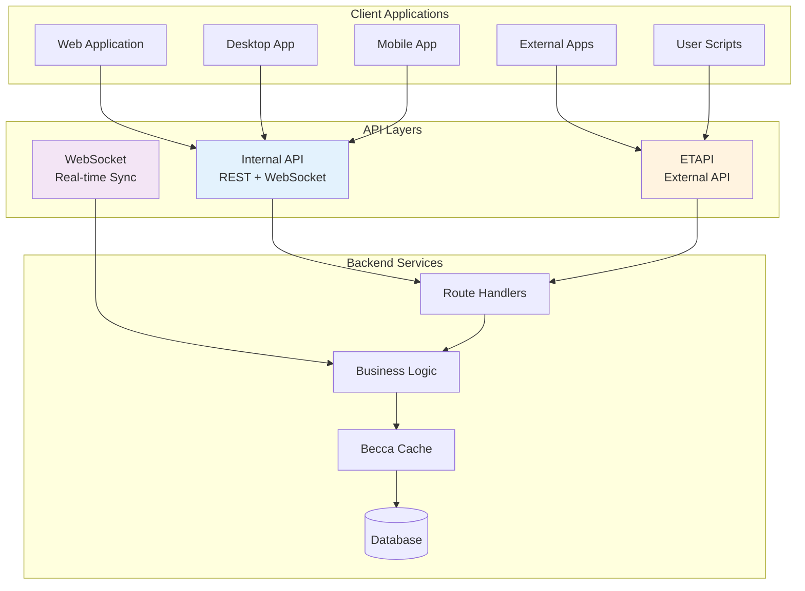

# API Architecture

Trilium provides multiple API layers for different use cases: Internal API for frontend-backend communication, ETAPI for external integrations, and WebSocket for real-time synchronization. This document details each API layer's design, usage, and best practices.

## API Layers Overview



## Internal API

**Location**: `/apps/server/src/routes/api/`

The Internal API handles communication between Trilium's frontend and backend, providing full access to application functionality.

### Architecture

```typescript
// Route structure
/api/
├── notes.ts           // Note operations
├── branches.ts        // Branch management
├── attributes.ts      // Attribute operations
├── tree.ts           // Tree structure
├── search.ts         // Search functionality
├── sync.ts           // Synchronization
├── options.ts        // Configuration
└── special.ts        // Special operations
```

### Request/Response Pattern

```typescript
// Typical API endpoint structure
router.get('/notes/:noteId', (req, res) => {
    const note = becca.getNote(req.params.noteId);
    
    if (!note) {
        return res.status(404).json({ 
            error: 'Note not found' 
        });
    }
    
    res.json(note.getPojo());
});

router.put('/notes/:noteId', (req, res) => {
    const note = becca.getNoteOrThrow(req.params.noteId);
    
    note.title = req.body.title;
    note.content = req.body.content;
    note.save();
    
    res.json({ success: true });
});
```

### Key Endpoints

#### Note Operations

```typescript
// Get note with content
GET /api/notes/:noteId
Response: {
    noteId: string,
    title: string,
    type: string,
    content: string,
    dateCreated: string,
    dateModified: string
}

// Update note
PUT /api/notes/:noteId
Body: {
    title?: string,
    content?: string,
    type?: string,
    mime?: string
}

// Create note
POST /api/notes/:parentNoteId/children
Body: {
    title: string,
    type: string,
    content?: string,
    position?: number
}

// Delete note
DELETE /api/notes/:noteId
```

#### Tree Operations

```typescript
// Get tree structure
GET /api/tree
Query: {
    subTreeNoteId?: string,
    includeAttributes?: boolean
}
Response: {
    notes: FNoteRow[],
    branches: FBranchRow[],
    attributes: FAttributeRow[]
}

// Move branch
PUT /api/branches/:branchId/move
Body: {
    parentNoteId: string,
    position: number
}
```

#### Search Operations

```typescript
// Execute search
GET /api/search
Query: {
    query: string,
    fastSearch?: boolean,
    includeArchivedNotes?: boolean,
    ancestorNoteId?: string
}
Response: {
    results: Array<{
        noteId: string,
        title: string,
        path: string,
        score: number
    }>
}
```

### Authentication & Security

```typescript
// CSRF protection
app.use(csrfMiddleware);

// Session authentication
router.use((req, res, next) => {
    if (!req.session.loggedIn) {
        return res.status(401).json({ 
            error: 'Not authenticated' 
        });
    }
    next();
});

// Protected note access
router.get('/notes/:noteId', (req, res) => {
    const note = becca.getNote(req.params.noteId);
    
    if (note.isProtected && !protectedSessionService.isProtectedSessionAvailable()) {
        return res.status(403).json({ 
            error: 'Protected session required' 
        });
    }
    
    res.json(note.getPojo());
});
```

## ETAPI (External API)

**Location**: `/apps/server/src/etapi/`

ETAPI provides a stable, versioned API for external applications and scripts to interact with Trilium.

### Architecture

```typescript
// ETAPI structure
/etapi/
├── etapi.openapi.yaml    // OpenAPI specification
├── auth.ts               // Authentication
├── notes.ts              // Note endpoints
├── branches.ts           // Branch endpoints
├── attributes.ts         // Attribute endpoints
├── attachments.ts        // Attachment endpoints
└── special_notes.ts      // Special note operations
```

### Authentication

ETAPI uses token-based authentication:

```typescript
// Creating ETAPI token
POST /etapi/auth/login
Body: {
    username: string,
    password: string
}
Response: {
    authToken: string
}

// Using token in requests
GET /etapi/notes/:noteId
Headers: {
    Authorization: "authToken"
}
```

### Key Endpoints

#### Note CRUD Operations

```typescript
// Create note
POST /etapi/notes
Body: {
    noteId?: string,
    parentNoteId: string,
    title: string,
    type: string,
    content?: string,
    position?: number
}

// Get note
GET /etapi/notes/:noteId
Response: {
    noteId: string,
    title: string,
    type: string,
    mime: string,
    isProtected: boolean,
    attributes: Array<{
        attributeId: string,
        type: string,
        name: string,
        value: string
    }>,
    parentNoteIds: string[],
    childNoteIds: string[],
    dateCreated: string,
    dateModified: string
}

// Update note content
PUT /etapi/notes/:noteId/content
Body: string | Buffer
Headers: {
    "Content-Type": mime-type
}

// Delete note
DELETE /etapi/notes/:noteId
```

#### Attribute Management

```typescript
// Create attribute
POST /etapi/attributes
Body: {
    noteId: string,
    type: 'label' | 'relation',
    name: string,
    value: string,
    isInheritable?: boolean
}

// Update attribute
PATCH /etapi/attributes/:attributeId
Body: {
    value?: string,
    isInheritable?: boolean
}
```

#### Search

```typescript
// Search notes
GET /etapi/notes/search
Query: {
    search: string,
    limit?: number,
    orderBy?: string,
    orderDirection?: 'asc' | 'desc'
}
Response: {
    results: Array<{
        noteId: string,
        title: string,
        // Other note properties
    }>
}
```

### Client Libraries

```javascript
// JavaScript client example
class EtapiClient {
    constructor(serverUrl, authToken) {
        this.serverUrl = serverUrl;
        this.authToken = authToken;
    }
    
    async getNote(noteId) {
        const response = await fetch(
            `${this.serverUrl}/etapi/notes/${noteId}`,
            {
                headers: {
                    'Authorization': this.authToken
                }
            }
        );
        return response.json();
    }
    
    async createNote(parentNoteId, title, content) {
        const response = await fetch(
            `${this.serverUrl}/etapi/notes`,
            {
                method: 'POST',
                headers: {
                    'Authorization': this.authToken,
                    'Content-Type': 'application/json'
                },
                body: JSON.stringify({
                    parentNoteId,
                    title,
                    type: 'text',
                    content
                })
            }
        );
        return response.json();
    }
}
```

### Python Client Example

```python
import requests

class TriliumETAPI:
    def __init__(self, server_url, auth_token):
        self.server_url = server_url
        self.auth_token = auth_token
        self.headers = {'Authorization': auth_token}
    
    def get_note(self, note_id):
        response = requests.get(
            f"{self.server_url}/etapi/notes/{note_id}",
            headers=self.headers
        )
        return response.json()
    
    def create_note(self, parent_note_id, title, content=""):
        response = requests.post(
            f"{self.server_url}/etapi/notes",
            headers=self.headers,
            json={
                'parentNoteId': parent_note_id,
                'title': title,
                'type': 'text',
                'content': content
            }
        )
        return response.json()
    
    def search_notes(self, query):
        response = requests.get(
            f"{self.server_url}/etapi/notes/search",
            headers=self.headers,
            params={'search': query}
        )
        return response.json()
```

## WebSocket Real-time Synchronization

**Location**: `/apps/server/src/services/ws.ts`

WebSocket connections provide real-time updates and synchronization between clients.

### Architecture

```typescript
// WebSocket message types
interface WSMessage {
    type: string;
    data: any;
}

// Common message types
type MessageType = 
    | 'entity-changes'      // Entity updates
    | 'sync'               // Sync events
    | 'note-content-change' // Content updates
    | 'refresh-tree'       // Tree structure changes
    | 'options-changed'    // Configuration updates
```

### Connection Management

```typescript
// Client connection
const ws = new WebSocket('wss://server/ws');

ws.on('open', () => {
    // Authenticate
    ws.send(JSON.stringify({
        type: 'auth',
        token: sessionToken
    }));
});

ws.on('message', (data) => {
    const message = JSON.parse(data);
    handleWSMessage(message);
});

// Server-side handling
import WebSocket from 'ws';

const wss = new WebSocket.Server({ server });

wss.on('connection', (ws, req) => {
    const session = parseSession(req);
    
    if (!session.authenticated) {
        ws.close(1008, 'Not authenticated');
        return;
    }
    
    clients.add(ws);
    
    ws.on('message', (message) => {
        handleClientMessage(ws, message);
    });
    
    ws.on('close', () => {
        clients.delete(ws);
    });
});
```

### Message Broadcasting

```typescript
// Broadcast entity changes
function broadcastEntityChanges(changes: EntityChange[]) {
    const message = {
        type: 'entity-changes',
        data: changes
    };
    
    for (const client of clients) {
        if (client.readyState === WebSocket.OPEN) {
            client.send(JSON.stringify(message));
        }
    }
}

// Targeted messages
function sendToClient(clientId: string, message: WSMessage) {
    const client = clients.get(clientId);
    if (client?.readyState === WebSocket.OPEN) {
        client.send(JSON.stringify(message));
    }
}
```

### Real-time Sync Protocol

```typescript
// Entity change notification
{
    type: 'entity-changes',
    data: [
        {
            entityName: 'notes',
            entityId: 'noteId123',
            action: 'update',
            entity: { /* note data */ }
        }
    ]
}

// Sync pull request
{
    type: 'sync-pull',
    data: {
        lastSyncId: 12345
    }
}

// Sync push
{
    type: 'sync-push',
    data: {
        entities: [ /* changed entities */ ]
    }
}
```

### Client-side Handling

```typescript
// Froca WebSocket integration
class WSClient {
    constructor() {
        this.ws = null;
        this.reconnectTimeout = null;
        this.connect();
    }
    
    connect() {
        this.ws = new WebSocket(this.getWSUrl());
        
        this.ws.onmessage = (event) => {
            const message = JSON.parse(event.data);
            this.handleMessage(message);
        };
        
        this.ws.onclose = () => {
            // Reconnect with exponential backoff
            this.scheduleReconnect();
        };
    }
    
    handleMessage(message: WSMessage) {
        switch (message.type) {
            case 'entity-changes':
                this.handleEntityChanges(message.data);
                break;
            case 'refresh-tree':
                froca.loadInitialTree();
                break;
            case 'note-content-change':
                this.handleContentChange(message.data);
                break;
        }
    }
    
    handleEntityChanges(changes: EntityChange[]) {
        for (const change of changes) {
            if (change.entityName === 'notes') {
                froca.reloadNotes([change.entityId]);
            }
        }
    }
}
```

## API Security

### Authentication Methods

```typescript
// 1. Session-based (Internal API)
app.use(session({
    secret: config.sessionSecret,
    resave: false,
    saveUninitialized: false
}));

// 2. Token-based (ETAPI)
router.use('/etapi', (req, res, next) => {
    const token = req.headers.authorization;
    
    const etapiToken = becca.getEtapiToken(token);
    if (!etapiToken || etapiToken.isExpired()) {
        return res.status(401).json({ 
            error: 'Invalid or expired token' 
        });
    }
    
    req.etapiToken = etapiToken;
    next();
});

// 3. WebSocket authentication
ws.on('connection', (socket) => {
    socket.on('auth', (token) => {
        if (!validateToken(token)) {
            socket.close(1008, 'Invalid token');
        }
    });
});
```

### Rate Limiting

```typescript
import rateLimit from 'express-rate-limit';

// Global rate limit
const globalLimiter = rateLimit({
    windowMs: 15 * 60 * 1000, // 15 minutes
    max: 1000 // limit each IP to 1000 requests per windowMs
});

// Strict limit for authentication
const authLimiter = rateLimit({
    windowMs: 15 * 60 * 1000,
    max: 5,
    message: 'Too many authentication attempts'
});

app.use('/api', globalLimiter);
app.use('/api/auth', authLimiter);
```

### Input Validation

```typescript
import { body, validationResult } from 'express-validator';

router.post('/api/notes',
    body('title').isString().isLength({ min: 1, max: 1000 }),
    body('type').isIn(['text', 'code', 'file', 'image']),
    body('content').optional().isString(),
    (req, res) => {
        const errors = validationResult(req);
        if (!errors.isEmpty()) {
            return res.status(400).json({ 
                errors: errors.array() 
            });
        }
        
        // Process valid input
    }
);
```

## Performance Optimization

### Caching Strategies

```typescript
// Response caching
const cache = new Map();

router.get('/api/notes/:noteId', (req, res) => {
    const cacheKey = `note:${req.params.noteId}`;
    const cached = cache.get(cacheKey);
    
    if (cached && cached.expires > Date.now()) {
        return res.json(cached.data);
    }
    
    const note = becca.getNote(req.params.noteId);
    const data = note.getPojo();
    
    cache.set(cacheKey, {
        data,
        expires: Date.now() + 60000 // 1 minute
    });
    
    res.json(data);
});
```

### Batch Operations

```typescript
// Batch API endpoint
router.post('/api/batch', async (req, res) => {
    const operations = req.body.operations;
    const results = [];
    
    await sql.transactional(async () => {
        for (const op of operations) {
            const result = await executeOperation(op);
            results.push(result);
        }
    });
    
    res.json({ results });
});

// Client batch usage
const batch = [
    { method: 'PUT', path: '/notes/1', body: { title: 'Note 1' }},
    { method: 'PUT', path: '/notes/2', body: { title: 'Note 2' }},
    { method: 'POST', path: '/notes/3/attributes', body: { type: 'label', name: 'todo' }}
];

await api.post('/batch', { operations: batch });
```

### Streaming Responses

```typescript
// Stream large data
router.get('/api/export', (req, res) => {
    res.writeHead(200, {
        'Content-Type': 'application/x-ndjson',
        'Transfer-Encoding': 'chunked'
    });
    
    const noteStream = createNoteExportStream();
    
    noteStream.on('data', (note) => {
        res.write(JSON.stringify(note) + '\n');
    });
    
    noteStream.on('end', () => {
        res.end();
    });
});
```

## Error Handling

### Standard Error Responses

```typescript
// Error response format
interface ErrorResponse {
    error: string;
    code?: string;
    details?: any;
}

// Error handling middleware
app.use((err: Error, req: Request, res: Response, next: NextFunction) => {
    console.error('API Error:', err);
    
    if (err instanceof NotFoundError) {
        return res.status(404).json({
            error: err.message,
            code: 'NOT_FOUND'
        });
    }
    
    if (err instanceof ValidationError) {
        return res.status(400).json({
            error: err.message,
            code: 'VALIDATION_ERROR',
            details: err.details
        });
    }
    
    // Generic error
    res.status(500).json({
        error: 'Internal server error',
        code: 'INTERNAL_ERROR'
    });
});
```

## API Documentation

### OpenAPI/Swagger

```yaml
# etapi.openapi.yaml
openapi: 3.0.0
info:
  title: Trilium ETAPI
  version: 1.0.0
  description: External API for Trilium Notes

paths:
  /etapi/notes/{noteId}:
    get:
      summary: Get note by ID
      parameters:
        - name: noteId
          in: path
          required: true
          schema:
            type: string
      responses:
        200:
          description: Note found
          content:
            application/json:
              schema:
                $ref: '#/components/schemas/Note'
        404:
          description: Note not found

components:
  schemas:
    Note:
      type: object
      properties:
        noteId:
          type: string
        title:
          type: string
        type:
          type: string
          enum: [text, code, file, image]
```

### API Testing

```typescript
// API test example
describe('Notes API', () => {
    it('should create a note', async () => {
        const response = await request(app)
            .post('/api/notes/root/children')
            .send({
                title: 'Test Note',
                type: 'text',
                content: 'Test content'
            })
            .expect(200);
            
        expect(response.body).toHaveProperty('noteId');
        expect(response.body.title).toBe('Test Note');
    });
    
    it('should handle errors', async () => {
        const response = await request(app)
            .get('/api/notes/invalid')
            .expect(404);
            
        expect(response.body).toHaveProperty('error');
    });
});
```

## Best Practices

### API Design

1. **RESTful conventions**: Use appropriate HTTP methods and status codes
2. **Consistent naming**: Use camelCase for JSON properties
3. **Versioning**: Version the API to maintain compatibility
4. **Documentation**: Keep OpenAPI spec up to date

### Security

1. **Authentication**: Always verify user identity
2. **Authorization**: Check permissions for each operation
3. **Validation**: Validate all input data
4. **Rate limiting**: Prevent abuse with appropriate limits

### Performance

1. **Pagination**: Limit response sizes with pagination
2. **Caching**: Cache frequently accessed data
3. **Batch operations**: Support bulk operations
4. **Async processing**: Use queues for long-running tasks

## Related Documentation

- [Three-Layer Cache System](Three-Layer-Cache-System.md) - Cache architecture
- [Entity System](Entity-System.md) - Data model
- [ETAPI Reference](/apps/server/src/etapi/etapi.openapi.yaml) - OpenAPI specification