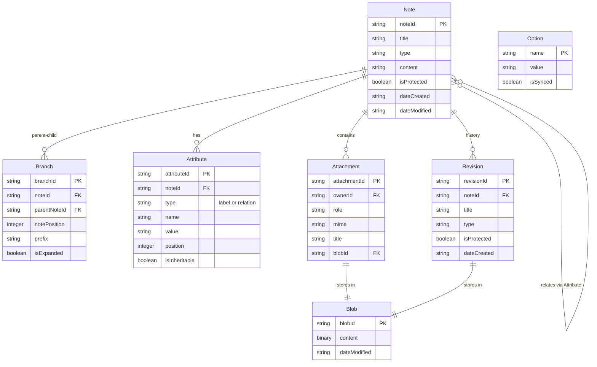

# Entity System Architecture

The Entity System forms the core data model of Trilium Notes, providing a flexible and powerful structure for organizing information. This document details the entities, their relationships, and usage patterns.

## Core Entities Overview



## Entity Definitions

### BNote - Notes with Content and Metadata

**Location**: `/apps/server/src/becca/entities/bnote.ts`

Notes are the fundamental unit of information in Trilium. Each note can contain different types of content and maintain relationships with other notes.

#### Properties

```typescript
class BNote {
    noteId: string;           // Unique identifier
    title: string;            // Display title
    type: string;             // Content type (text, code, file, etc.)
    mime: string;             // MIME type for content
    isProtected: boolean;     // Encryption flag
    dateCreated: string;      // Creation timestamp
    dateModified: string;     // Last modification
    utcDateCreated: string;   // UTC creation
    utcDateModified: string;  // UTC modification
    
    // Relationships
    parentBranches: BBranch[];  // Parent connections
    children: BBranch[];        // Child connections
    attributes: BAttribute[];   // Metadata
    
    // Content
    content?: string | Buffer;  // Note content (lazy loaded)
    
    // Computed
    isDecrypted: boolean;       // Decryption status
}
```

#### Note Types

- **text**: Rich text content with HTML formatting
- **code**: Source code with syntax highlighting
- **file**: Binary file attachment
- **image**: Image with preview capabilities
- **search**: Saved search query
- **book**: Container for hierarchical documentation
- **relationMap**: Visual relationship diagram
- **canvas**: Drawing canvas (Excalidraw)
- **mermaid**: Mermaid diagram
- **mindMap**: Mind mapping visualization
- **webView**: Embedded web content
- **noteMap**: Tree visualization

#### Usage Examples

```typescript
// Create a new note
const note = new BNote({
    noteId: generateNoteId(),
    title: "My Note",
    type: "text",
    mime: "text/html",
    content: "<p>Note content</p>"
});
note.save();

// Get note with content
const note = becca.getNote(noteId);
await note.loadContent();

// Update note
note.title = "Updated Title";
note.save();

// Protect note
note.isProtected = true;
note.encrypt();
note.save();
```

### BBranch - Hierarchical Relationships

**Location**: `/apps/server/src/becca/entities/bbranch.ts`

Branches define the parent-child relationships between notes, allowing a note to have multiple parents (cloning).

#### Properties

```typescript
class BBranch {
    branchId: string;        // Unique identifier
    noteId: string;          // Child note ID
    parentNoteId: string;    // Parent note ID
    notePosition: number;    // Order among siblings
    prefix: string;          // Optional prefix label
    isExpanded: boolean;     // Tree UI state
    
    // Computed
    childNote: BNote;        // Reference to child
    parentNote: BNote;       // Reference to parent
}
```

#### Key Features

- **Multiple Parents**: Notes can appear in multiple locations
- **Ordering**: Explicit positioning among siblings
- **Prefixes**: Optional labels for context (e.g., "Chapter 1:")
- **UI State**: Expansion state persisted per branch

#### Usage Examples

```typescript
// Create parent-child relationship
const branch = new BBranch({
    noteId: childNote.noteId,
    parentNoteId: parentNote.noteId,
    notePosition: 10
});
branch.save();

// Clone note to another parent
const cloneBranch = childNote.cloneTo(otherParent.noteId);

// Reorder children
parentNote.sortChildren((a, b) => 
    a.title.localeCompare(b.title)
);

// Add prefix
branch.prefix = "Important: ";
branch.save();
```

### BAttribute - Key-Value Metadata

**Location**: `/apps/server/src/becca/entities/battribute.ts`

Attributes provide flexible metadata and relationships between notes.

#### Types

1. **Labels**: Key-value pairs for metadata
2. **Relations**: References to other notes

#### Properties

```typescript
class BAttribute {
    attributeId: string;     // Unique identifier
    noteId: string;          // Owning note
    type: 'label' | 'relation';
    name: string;            // Attribute name
    value: string;           // Value or target noteId
    position: number;        // Display order
    isInheritable: boolean;  // Inherited by children
    
    // Computed
    note: BNote;             // Owner note
    targetNote?: BNote;      // For relations
}
```

#### Common Patterns

```typescript
// Add label
note.addLabel("status", "active");
note.addLabel("priority", "high");

// Add relation
note.addRelation("template", templateNoteId);
note.addRelation("renderNote", renderNoteId);

// Query by attributes
const todos = becca.findAttributes("label", "todoItem");
const templates = becca.findAttributes("label", "template");

// Inheritable attributes
note.addLabel("workspace", "project", true); // Children inherit
```

#### System Attributes

Special attributes with system behavior:

- `#hidePromotedAttributes`: Hide promoted attributes in UI
- `#readOnly`: Prevent note editing
- `#autoReadOnlyDisabled`: Disable auto read-only
- `#hideChildrenOverview`: Hide children count
- `~template`: Note template relation
- `~renderNote`: Custom rendering relation

### BRevision - Version History

**Location**: `/apps/server/src/becca/entities/brevision.ts`

Revisions provide version history and recovery capabilities.

#### Properties

```typescript
class BRevision {
    revisionId: string;      // Unique identifier
    noteId: string;          // Parent note
    type: string;            // Content type
    mime: string;            // MIME type
    title: string;           // Historical title
    isProtected: boolean;    // Encryption flag
    dateCreated: string;     // Creation time
    utcDateCreated: string;  // UTC time
    dateModified: string;    // Content modification
    blobId: string;          // Content storage
    
    // Methods
    getContent(): string | Buffer;
    restore(): void;
}
```

#### Revision Strategy

- Created automatically on significant changes
- Configurable retention period
- Day/week/month/year retention rules
- Protected note revisions are encrypted

#### Usage Examples

```typescript
// Get note revisions
const revisions = note.getRevisions();

// Restore revision
const revision = becca.getRevision(revisionId);
revision.restore();

// Manual revision creation
note.saveRevision();

// Compare revisions
const diff = revision1.getContent() !== revision2.getContent();
```

### BOption - Application Configuration

**Location**: `/apps/server/src/becca/entities/boption.ts`

Options store application and user preferences.

#### Properties

```typescript
class BOption {
    name: string;            // Option key
    value: string;           // Option value
    isSynced: boolean;       // Sync across instances
    utcDateModified: string; // Last change
}
```

#### Common Options

```typescript
// Theme settings
setOption("theme", "dark");

// Protected session timeout
setOption("protectedSessionTimeout", "600");

// Sync settings
setOption("syncServerHost", "https://sync.server");

// Note settings
setOption("defaultNoteType", "text");
```

### BAttachment - File Attachments

**Location**: `/apps/server/src/becca/entities/battachment.ts`

Attachments link binary content to notes.

#### Properties

```typescript
class BAttachment {
    attachmentId: string;    // Unique identifier
    ownerId: string;         // Parent note ID
    role: string;            // Attachment role
    mime: string;            // MIME type
    title: string;           // Display title
    blobId: string;          // Content reference
    utcDateScheduledForDeletion: string;
    
    // Methods
    getContent(): Buffer;
    getBlob(): BBlob;
}
```

#### Usage Patterns

```typescript
// Add attachment to note
const attachment = note.addAttachment({
    role: "file",
    mime: "application/pdf",
    title: "document.pdf",
    content: buffer
});

// Get attachments
const attachments = note.getAttachments();

// Download attachment
const content = attachment.getContent();
```

## Entity Relationships

### Parent-Child Hierarchy

```typescript
// Single parent
childNote.setParent(parentNote.noteId);

// Multiple parents (cloning)
childNote.cloneTo(parent1.noteId);
childNote.cloneTo(parent2.noteId);

// Get parents
const parents = childNote.getParentNotes();

// Get children
const children = parentNote.getChildNotes();

// Get subtree
const subtree = parentNote.getSubtreeNotes();
```

### Attribute Relationships

```typescript
// Direct relations
note.addRelation("author", authorNote.noteId);

// Bidirectional relations
note1.addRelation("related", note2.noteId);
note2.addRelation("related", note1.noteId);

// Get related notes
const related = note.getRelations("related");

// Get notes relating to this one
const targetRelations = note.getTargetRelations();
```

## Entity Lifecycle

### Creation

```typescript
// Note creation
const note = new BNote({
    noteId: generateNoteId(),
    title: "New Note",
    type: "text"
});
note.save();

// With parent
const child = parentNote.addChild({
    title: "Child Note",
    type: "text",
    content: "Content"
});
```

### Updates

```typescript
// Atomic updates
note.title = "New Title";
note.save();

// Batch updates
sql.transactional(() => {
    note1.title = "Title 1";
    note1.save();
    
    note2.content = "Content 2";
    note2.save();
});
```

### Deletion

```typescript
// Soft delete (move to trash)
note.deleteNote();

// Mark for deletion
note.isDeleted = true;
note.save();

// Permanent deletion (after grace period)
note.eraseNote();
```

## Performance Considerations

### Lazy Loading

```typescript
// Note content loaded on demand
const note = becca.getNote(noteId); // Metadata only
await note.loadContent(); // Load content when needed

// Revisions loaded on demand
const revisions = note.getRevisions(); // Database query
```

### Batch Operations

```typescript
// Efficient bulk loading
const notes = becca.getNotes(noteIds);

// Batch attribute queries
const attributes = sql.getRows(`
    SELECT * FROM attributes 
    WHERE noteId IN (???) 
    AND name = ?
`, [noteIds, 'label']);
```

### Indexing

```typescript
// Attribute index for fast lookups
const labels = becca.findAttributes("label", "important");

// Branch index for relationship queries
const branch = becca.getBranchFromChildAndParent(childId, parentId);
```

## Best Practices

### Entity Creation

```typescript
// Always use transactions for multiple operations
sql.transactional(() => {
    const note = new BNote({...});
    note.save();
    
    note.addLabel("status", "draft");
    note.addRelation("template", templateId);
});
```

### Entity Updates

```typescript
// Check existence before update
const note = becca.getNote(noteId);
if (note) {
    note.title = "Updated";
    note.save();
}

// Use proper error handling
try {
    const note = becca.getNoteOrThrow(noteId);
    note.save();
} catch (e) {
    log.error(`Note ${noteId} not found`);
}
```

### Querying

```typescript
// Use indexed queries
const attrs = becca.findAttributes("label", "task");

// Avoid N+1 queries
const noteIds = [...];
const notes = becca.getNotes(noteIds); // Single batch

// Use SQL for complex queries
const results = sql.getRows(`
    SELECT n.noteId, n.title, COUNT(b.branchId) as childCount
    FROM notes n
    LEFT JOIN branches b ON b.parentNoteId = n.noteId
    GROUP BY n.noteId
`);
```

## Troubleshooting

### Common Issues

1. **Circular References**
   ```typescript
   // Detect cycles before creating branches
   if (!parentNote.hasAncestor(childNote.noteId)) {
       childNote.setParent(parentNote.noteId);
   }
   ```

2. **Orphaned Entities**
   ```typescript
   // Find orphaned notes
   const orphans = sql.getRows(`
       SELECT noteId FROM notes
       WHERE noteId != 'root'
       AND noteId NOT IN (SELECT noteId FROM branches)
   `);
   ```

3. **Attribute Conflicts**
   ```typescript
   // Handle duplicate attributes
   const existing = note.getAttribute("label", "status");
   if (existing) {
       existing.value = "new value";
       existing.save();
   } else {
       note.addLabel("status", "new value");
   }
   ```

## Related Documentation

- [Three-Layer Cache System](Three-Layer-Cache-System.md) - Cache architecture
- [Database Schema](../Development%20and%20architecture/Database/notes.md) - Database structure
- [Script API](../../Script%20API/) - Entity API for scripts