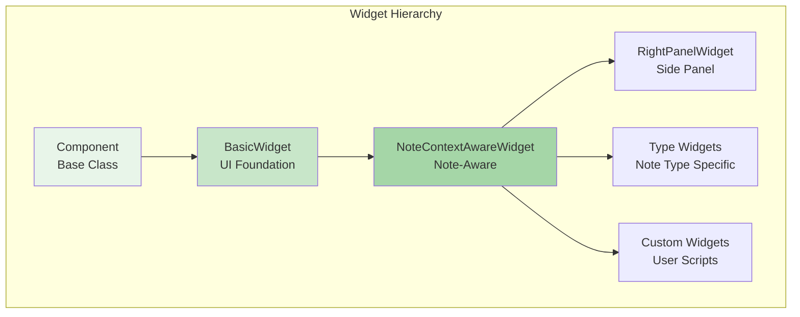

# Widget-Based UI Architecture

Trilium's frontend is built on a modular widget system that provides flexibility, reusability, and maintainability. This architecture enables dynamic UI composition and extensibility through custom widgets.

## Widget System Overview



## Core Widget Classes

### Component (Base Class)

**Location**: `/apps/client/src/components/component.js`

The foundational class for all UI components in Trilium.

```typescript
class Component {
    componentId: string;      // Unique identifier
    children: Component[];    // Child components
    parent: Component | null; // Parent reference
    
    async refresh(): Promise<void>;
    child(...components: Component[]): this;
    handleEvent(name: string, data: any): void;
    trigger(name: string, data?: any): void;
}
```

### BasicWidget

**Location**: `/apps/client/src/widgets/basic_widget.ts`

Base class for all UI widgets, providing DOM manipulation and styling capabilities.

```typescript
export class BasicWidget extends Component {
    protected $widget: JQuery;
    private attrs: Record<string, string>;
    private classes: string[];
    
    // Chaining methods for declarative UI
    id(id: string): this;
    class(className: string): this;
    css(name: string, value: string): this;
    contentSized(): this;
    collapsible(): this;
    filling(): this;
    
    // Conditional rendering
    optChild(condition: boolean, ...components: Component[]): this;
    optCss(condition: boolean, name: string, value: string): this;
    
    // Rendering
    doRender(): JQuery;
}
```

#### Usage Example

```typescript
class MyWidget extends BasicWidget {
    doRender() {
        this.$widget = $('<div>')
            .addClass('my-widget')
            .append($('<h3>').text('Widget Title'));
            
        return this.$widget;
    }
    
    async refreshWithNote(note: FNote) {
        this.$widget.find('h3').text(note.title);
    }
}

// Composing widgets
const container = new FlexContainer('column')
    .id('main-container')
    .css('padding', '10px')
    .filling()
    .child(
        new MyWidget(),
        new ButtonWidget()
            .title('Click Me')
            .onClick(() => console.log('Clicked'))
    );
```

### NoteContextAwareWidget

**Location**: `/apps/client/src/widgets/note_context_aware_widget.ts`

Base class for widgets that respond to note context changes.

```typescript
class NoteContextAwareWidget extends BasicWidget {
    noteContext: NoteContext | null;
    note: FNote | null;
    noteId: string | null;
    notePath: string | null;
    
    // Lifecycle methods
    async refresh(): Promise<void>;
    async refreshWithNote(note: FNote): Promise<void>;
    async noteSwitched(): Promise<void>;
    async activeContextChanged(): Promise<void>;
    
    // Event handlers
    async noteTypeMimeChanged(): Promise<void>;
    async frocaReloaded(): Promise<void>;
    
    // Utility methods
    isNote(noteId: string): boolean;
    get isEnabled(): boolean;
}
```

#### Context Management

```typescript
class MyNoteWidget extends NoteContextAwareWidget {
    async refreshWithNote(note: FNote) {
        // Called when note context changes
        this.$widget.find('.note-title').text(note.title);
        this.$widget.find('.note-type').text(note.type);
        
        // Access note attributes
        const labels = note.getLabels();
        const relations = note.getRelations();
    }
    
    async noteSwitched() {
        // Called when user switches to different note
        console.log(`Switched to note: ${this.noteId}`);
    }
    
    async noteTypeMimeChanged() {
        // React to note type changes
        if (this.note?.type === 'code') {
            this.setupCodeHighlighting();
        }
    }
}
```

### RightPanelWidget

**Location**: `/apps/client/src/widgets/right_panel_widget.ts`

Base class for widgets displayed in the right sidebar panel.

```typescript
abstract class RightPanelWidget extends NoteContextAwareWidget {
    async doRenderBody(): Promise<JQuery>;
    getTitle(): string;
    getIcon(): string;
    getPosition(): number;
    
    async isEnabled(): Promise<boolean> {
        // Override to control visibility
        return true;
    }
}
```

#### Creating Right Panel Widgets

```typescript
class InfoWidget extends RightPanelWidget {
    getTitle() { return "Note Info"; }
    getIcon() { return "info"; }
    getPosition() { return 100; }
    
    async doRenderBody() {
        return $('<div class="info-widget">')
            .append($('<div class="created">'))
            .append($('<div class="modified">'))
            .append($('<div class="word-count">'));
    }
    
    async refreshWithNote(note: FNote) {
        this.$body.find('.created').text(`Created: ${note.dateCreated}`);
        this.$body.find('.modified').text(`Modified: ${note.dateModified}`);
        
        const wordCount = this.calculateWordCount(await note.getContent());
        this.$body.find('.word-count').text(`Words: ${wordCount}`);
    }
}
```

## Type-Specific Widgets

**Location**: `/apps/client/src/widgets/type_widgets/`

Each note type has a specialized widget for rendering and editing.

### TypeWidget Interface

```typescript
abstract class TypeWidget extends NoteContextAwareWidget {
    abstract static getType(): string;
    
    // Content management
    async getContent(): Promise<string>;
    async saveContent(content: string): Promise<void>;
    
    // Focus management
    async focus(): Promise<void>;
    async blur(): Promise<void>;
    
    // Cleanup
    async cleanup(): Promise<void>;
}
```

### Common Type Widgets

#### TextTypeWidget

```typescript
class TextTypeWidget extends TypeWidget {
    static getType() { return 'text'; }
    
    private textEditor: TextEditor;
    
    async doRender() {
        const $editor = $('<div class="ck-editor">');
        this.textEditor = await TextEditor.create($editor[0], {
            noteId: this.noteId,
            content: await this.note.getContent()
        });
        
        return $editor;
    }
    
    async getContent() {
        return this.textEditor.getData();
    }
}
```

#### CodeTypeWidget

```typescript
class CodeTypeWidget extends TypeWidget {
    static getType() { return 'code'; }
    
    private codeMirror: CodeMirror;
    
    async doRender() {
        const $container = $('<div class="code-editor">');
        
        this.codeMirror = CodeMirror($container[0], {
            value: await this.note.getContent(),
            mode: this.note.mime,
            theme: 'default',
            lineNumbers: true
        });
        
        return $container;
    }
}
```

## Widget Composition

### Container Widgets

```typescript
// Flexible container layouts
class FlexContainer extends BasicWidget {
    constructor(private direction: 'row' | 'column') {
        super();
    }
    
    doRender() {
        this.$widget = $('<div class="flex-container">')
            .css('display', 'flex')
            .css('flex-direction', this.direction);
            
        for (const child of this.children) {
            this.$widget.append(child.render());
        }
        
        return this.$widget;
    }
}

// Tab container
class TabContainer extends BasicWidget {
    private tabs: Array<{title: string, widget: BasicWidget}> = [];
    
    addTab(title: string, widget: BasicWidget) {
        this.tabs.push({title, widget});
        this.child(widget);
        return this;
    }
    
    doRender() {
        // Render tab headers and content panels
    }
}
```

### Composite Widgets

```typescript
class NoteEditorWidget extends NoteContextAwareWidget {
    private typeWidget: TypeWidget;
    private titleWidget: NoteTitleWidget;
    private toolbarWidget: NoteToolbarWidget;
    
    constructor() {
        super();
        
        this.child(
            this.toolbarWidget = new NoteToolbarWidget(),
            this.titleWidget = new NoteTitleWidget(),
            // Type widget added dynamically
        );
    }
    
    async refreshWithNote(note: FNote) {
        // Remove old type widget
        if (this.typeWidget) {
            this.typeWidget.remove();
        }
        
        // Add appropriate type widget
        const WidgetClass = typeWidgetService.getWidgetClass(note.type);
        this.typeWidget = new WidgetClass();
        this.child(this.typeWidget);
        
        await this.typeWidget.refresh();
    }
}
```

## Widget Communication

### Event System

```typescript
// Publishing events
class PublisherWidget extends BasicWidget {
    async handleClick() {
        // Local event
        this.trigger('itemSelected', { itemId: '123' });
        
        // Global event
        appContext.triggerEvent('noteChanged', { noteId: this.noteId });
    }
}

// Subscribing to events
class SubscriberWidget extends BasicWidget {
    constructor() {
        super();
        
        // Local event subscription
        this.on('itemSelected', (event) => {
            console.log('Item selected:', event.itemId);
        });
        
        // Global event subscription
        appContext.addEventListener('noteChanged', (event) => {
            this.handleNoteChange(event.noteId);
        });
    }
}
```

### Command System

```typescript
// Registering commands
class CommandWidget extends BasicWidget {
    constructor() {
        super();
        
        this.bindCommand('saveNote', () => this.saveNote());
        this.bindCommand('deleteNote', () => this.deleteNote());
    }
    
    getCommands() {
        return [
            {
                command: 'myWidget:doAction',
                handler: () => this.doAction(),
                hotkey: 'ctrl+shift+a'
            }
        ];
    }
}
```

## Custom Widget Development

### Creating Custom Widgets

```typescript
// 1. Define widget class
class TaskListWidget extends NoteContextAwareWidget {
    doRender() {
        this.$widget = $('<div class="task-list-widget">');
        this.$list = $('<ul>').appendTo(this.$widget);
        return this.$widget;
    }
    
    async refreshWithNote(note: FNote) {
        const tasks = await this.loadTasks(note);
        
        this.$list.empty();
        for (const task of tasks) {
            $('<li>')
                .text(task.title)
                .toggleClass('completed', task.completed)
                .appendTo(this.$list);
        }
    }
    
    private async loadTasks(note: FNote) {
        // Load task data from note attributes
        const taskLabels = note.getLabels('task');
        return taskLabels.map(label => JSON.parse(label.value));
    }
}

// 2. Register widget
api.addWidget(TaskListWidget);
```

### Widget Lifecycle

```typescript
class LifecycleWidget extends NoteContextAwareWidget {
    // 1. Construction
    constructor() {
        super();
        console.log('Widget constructed');
    }
    
    // 2. Initial render
    doRender() {
        console.log('Initial render');
        return $('<div>');
    }
    
    // 3. Context initialization
    async refresh() {
        console.log('Context refresh');
        await super.refresh();
    }
    
    // 4. Note updates
    async refreshWithNote(note: FNote) {
        console.log('Note refresh:', note.noteId);
    }
    
    // 5. Cleanup
    async cleanup() {
        console.log('Widget cleanup');
        // Release resources
    }
}
```

## Performance Optimization

### Lazy Loading

```typescript
class LazyWidget extends BasicWidget {
    private contentLoaded = false;
    
    async becomeVisible() {
        if (!this.contentLoaded) {
            await this.loadContent();
            this.contentLoaded = true;
        }
    }
    
    private async loadContent() {
        // Heavy content loading
        const data = await server.get('expensive-data');
        this.renderContent(data);
    }
}
```

### Debouncing Updates

```typescript
class DebouncedWidget extends NoteContextAwareWidget {
    private refreshDebounced = utils.debounce(
        () => this.doRefresh(),
        500
    );
    
    async refreshWithNote(note: FNote) {
        // Debounce rapid updates
        this.refreshDebounced();
    }
    
    private async doRefresh() {
        // Actual refresh logic
    }
}
```

### Virtual Scrolling

```typescript
class VirtualListWidget extends BasicWidget {
    private visibleItems: any[] = [];
    
    renderVisibleItems(scrollTop: number) {
        const itemHeight = 30;
        const containerHeight = this.$widget.height();
        
        const startIndex = Math.floor(scrollTop / itemHeight);
        const endIndex = Math.ceil((scrollTop + containerHeight) / itemHeight);
        
        this.visibleItems = this.allItems.slice(startIndex, endIndex);
        this.renderItems();
    }
}
```

## Best Practices

### Widget Design

1. **Single Responsibility**: Each widget should have one clear purpose
2. **Composition over Inheritance**: Use composition for complex UIs
3. **Lazy Initialization**: Load resources only when needed
4. **Event Cleanup**: Remove event listeners in cleanup()

### State Management

```typescript
class StatefulWidget extends NoteContextAwareWidget {
    private state = {
        isExpanded: false,
        selectedItems: new Set<string>()
    };
    
    setState(updates: Partial<typeof this.state>) {
        Object.assign(this.state, updates);
        this.renderState();
    }
    
    private renderState() {
        this.$widget.toggleClass('expanded', this.state.isExpanded);
        // Update DOM based on state
    }
}
```

### Error Handling

```typescript
class ResilientWidget extends BasicWidget {
    async refreshWithNote(note: FNote) {
        try {
            await this.loadData(note);
        } catch (error) {
            this.showError('Failed to load data');
            console.error('Widget error:', error);
        }
    }
    
    private showError(message: string) {
        this.$widget.html(`
            <div class="alert alert-danger">
                ${message}
            </div>
        `);
    }
}
```

## Testing Widgets

```typescript
// Widget test example
describe('TaskListWidget', () => {
    let widget: TaskListWidget;
    let note: FNote;
    
    beforeEach(() => {
        widget = new TaskListWidget();
        note = createMockNote({
            noteId: 'test123',
            attributes: [
                { type: 'label', name: 'task', value: '{"title":"Task 1"}' }
            ]
        });
    });
    
    it('should render tasks', async () => {
        await widget.refreshWithNote(note);
        
        const tasks = widget.$widget.find('li');
        expect(tasks.length).toBe(1);
        expect(tasks.text()).toBe('Task 1');
    });
});
```

## Related Documentation

- [Frontend Basics](../../Scripting/Frontend%20Basics.html) - Frontend scripting guide
- [Custom Widgets](../../Scripting/Custom%20Widgets.html) - Creating custom widgets
- [Script API](../../Script%20API/) - Widget API reference