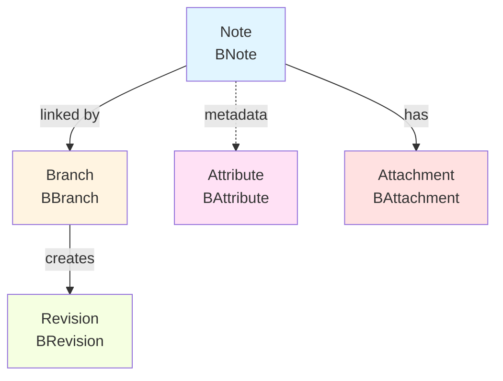

# Entities
### Entity System

Trilium's data model is based on five core entities:



#### Entity Definitions

**1\. BNote** (`apps/server/src/becca/entities/bnote.ts`)

*   Represents a note with title, content, and metadata
*   Type can be: text, code, file, image, canvas, mermaid, etc.
*   Contains content via blob reference
*   Can be protected (encrypted)
*   Has creation and modification timestamps

**2\. BBranch** (`apps/server/src/becca/entities/bbranch.ts`)

*   Represents parent-child relationship between notes
*   Enables note cloning (multiple parents)
*   Contains positioning information
*   Has optional prefix for customization
*   Tracks expansion state in tree

**3\. BAttribute** (`apps/server/src/becca/entities/battribute.ts`)

*   Key-value metadata attached to notes
*   Two types: labels (tags) and relations (links)
*   Can be inheritable to child notes
*   Used for search, organization, and scripting
*   Supports promoted attributes (displayed prominently)

**4\. BRevision** (`apps/server/src/becca/entities/brevision.ts`)

*   Stores historical versions of note content
*   Automatic versioning on edits
*   Retains title, type, and content
*   Enables note history browsing and restoration

**5\. BAttachment** (`apps/server/src/becca/entities/battachment.ts`)

*   File attachments linked to notes
*   Has owner (note), role, and mime type
*   Content stored in blobs
*   Can be protected (encrypted)

**6\. BBlob** (`apps/server/src/becca/entities/bblob.ts`)

*   Binary large object storage
*   Stores actual note content and attachments
*   Referenced by notes, revisions, and attachments
*   Supports encryption for protected content

### Widget-Based UI

The frontend uses a **widget system** for modular, reusable UI components.

Located at: `apps/client/src/widgets/`

```typescript
// Widget Hierarchy
BasicWidget
├── NoteContextAwareWidget (responds to note changes)
│   ├── RightPanelWidget (displayed in right sidebar)
│   └── Type-specific widgets
├── Container widgets (tabs, ribbons, etc.)
└── Specialized widgets (search, calendar, etc.)
```

**Base Classes:**

1.  **BasicWidget** (`basic_widget.ts`)
    *   Base class for all UI components
    *   Lifecycle: construction → rendering → events → destruction
    *   Handles DOM manipulation
    *   Event subscription management
    *   Child widget management
2.  **NoteContextAwareWidget** (`note_context_aware_widget.ts`)
    *   Extends BasicWidget
    *   Automatically updates when active note changes
    *   Accesses current note context
    *   Used for note-dependent UI
3.  **RightPanelWidget**
    *   Widgets displayed in right sidebar
    *   Collapsible sections
    *   Context-specific tools and information

**Type-Specific Widgets:**

Each note type has a dedicated widget, which are located in `apps/client/src/widgets/type_widgets`.