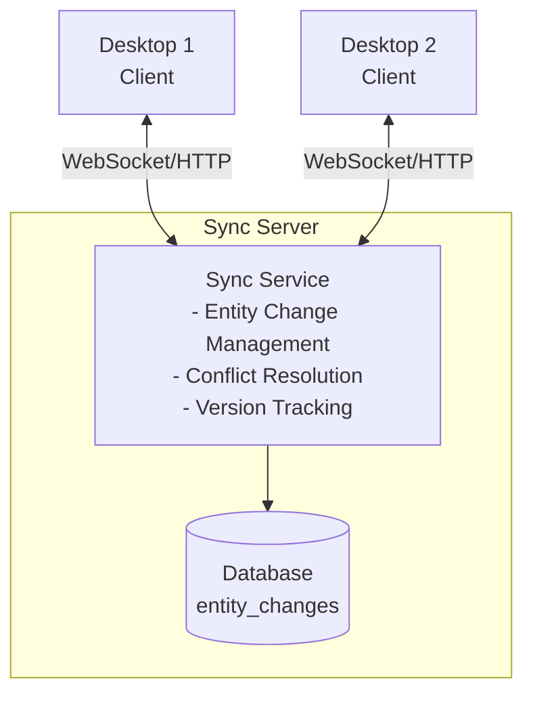

# Trilium Synchronization Architecture

> **Related:** [ARCHITECTURE.md](ARCHITECTURE.md) | [User Guide: Synchronization](https://triliumnext.github.io/Docs/Wiki/synchronization)

## Overview

Trilium implements a sophisticated **bidirectional synchronization system** that allows users to sync their note databases across multiple devices (desktop clients and server instances). The sync protocol is designed to handle:

- Concurrent modifications across devices
- Conflict resolution
- Partial sync (only changed entities)
- Protected note synchronization
- Efficient bandwidth usage

## Sync Architecture



## Core Concepts

### Entity Changes

Every modification to any entity (note, branch, attribute, etc.) creates an **entity change** record:

```sql
entity_changes (
    id,                    -- Auto-increment ID
    entityName,            -- 'notes', 'branches', 'attributes', etc.
    entityId,              -- ID of the changed entity
    hash,                  -- Content hash for integrity
    isErased,              -- If entity was erased (deleted permanently)
    changeId,              -- Unique change identifier
    componentId,           -- Installation identifier
    instanceId,            -- Process instance identifier
    isSynced,              -- Whether synced to server
    utcDateChanged         -- When change occurred
)
```

**Key Properties:**
- **changeId**: Globally unique identifier (UUID) for the change
- **componentId**: Unique per Trilium installation (persists across restarts)
- **instanceId**: Unique per process (changes on restart)
- **hash**: SHA-256 hash of entity data for integrity verification

### Sync Versions

Each Trilium installation tracks:
- **Local sync version**: Highest change ID seen locally
- **Server sync version**: Highest change ID on server
- **Entity versions**: Last sync version for each entity type

### Change Tracking

**When an entity is modified:**

```typescript
// apps/server/src/services/entity_changes.ts
function addEntityChange(entityName, entityId, entity) {
    const hash = calculateHash(entity)
    const changeId = generateUUID()
    
    sql.insert('entity_changes', {
        entityName,
        entityId,
        hash,
        changeId,
        componentId: config.componentId,
        instanceId: config.instanceId,
        isSynced: 0,
        utcDateChanged: now()
    })
}
```

**Entity modification triggers:**
- Note content update
- Note metadata change
- Branch creation/deletion/reorder
- Attribute addition/removal
- Options modification

## Sync Protocol

### Sync Handshake

**Step 1: Client Initiates Sync**

```typescript
// Client sends current sync version
POST /api/sync/check
{
    "sourceId": "client-component-id",
    "maxChangeId": 12345
}
```

**Step 2: Server Responds with Status**

```typescript
// Server checks for changes
Response:
{
    "entityChanges": 567,        // Changes on server
    "maxChangeId": 12890,        // Server's max change ID
    "outstandingPushCount": 23   // Client changes not yet synced
}
```

**Step 3: Decision**

- If `entityChanges > 0`: Pull changes from server
- If `outstandingPushCount > 0`: Push changes to server
- Both can happen in sequence

### Pull Sync (Server → Client)

**Client Requests Changes:**

```typescript
POST /api/sync/pull
{
    "sourceId": "client-component-id",
    "lastSyncedChangeId": 12345
}
```

**Server Responds:**

```typescript
Response:
{
    "notes": [
        { noteId: "abc", title: "New Note", ... }
    ],
    "branches": [...],
    "attributes": [...],
    "revisions": [...],
    "attachments": [...],
    "entityChanges": [
        { entityName: "notes", entityId: "abc", changeId: "...", ... }
    ],
    "maxChangeId": 12890
}
```

**Client Processing:**

1. Apply entity changes to local database
2. Update Froca cache
3. Update local sync version
4. Trigger UI refresh

### Push Sync (Client → Server)

**Client Sends Changes:**

```typescript
POST /api/sync/push
{
    "sourceId": "client-component-id",
    "entities": [
        {
            "entity": {
                "noteId": "xyz",
                "title": "Modified Note",
                ...
            },
            "entityChange": {
                "changeId": "change-uuid",
                "entityName": "notes",
                ...
            }
        }
    ]
}
```

**Server Processing:**

1. Validate changes
2. Check for conflicts
3. Apply changes to database
4. Update Becca cache
5. Mark as synced
6. Broadcast to other connected clients via WebSocket

**Conflict Detection:**

```typescript
// Check if entity was modified on server since client's last sync
const serverEntity = becca.getNote(noteId)
const serverLastModified = serverEntity.utcDateModified

if (serverLastModified > clientSyncVersion) {
    // CONFLICT!
    resolveConflict(serverEntity, clientEntity)
}
```

## Conflict Resolution

### Conflict Types

**1. Content Conflict**
- Both client and server modified same note content
- **Resolution**: Last-write-wins based on `utcDateModified`

**2. Structure Conflict**
- Branch moved/deleted on one side, modified on other
- **Resolution**: Tombstone records, reconciliation

**3. Attribute Conflict**
- Same attribute modified differently
- **Resolution**: Last-write-wins

### Conflict Resolution Strategy

**Last-Write-Wins:**
```typescript
if (clientEntity.utcDateModified > serverEntity.utcDateModified) {
    // Client wins, apply client changes
    applyClientChange(clientEntity)
} else {
    // Server wins, reject client change
    // Client will pull server version on next sync
}
```

**Tombstone Records:**
- Deleted entities leave tombstone in `entity_changes`
- Prevents re-sync of deleted items
- `isErased = 1` for permanent deletions

### Protected Notes Sync

**Challenge:** Encrypted content can't be synced without password

**Solution:**

1. **Protected session required**: User must unlock protected notes
2. **Encrypted sync**: Content synced in encrypted form
3. **Hash verification**: Integrity checked without decryption
4. **Lazy decryption**: Only decrypt when accessed

**Sync Flow:**

```typescript
// Client side
if (note.isProtected && !protectedSessionHolder.isProtectedSessionAvailable()) {
    // Skip protected notes if session not active
    continue
}

// Server side
if (note.isProtected) {
    // Sync encrypted blob
    // Don't decrypt for sync
    syncEncryptedBlob(note.blobId)
}
```

## Sync States

### Connection States

- **Connected**: WebSocket connection active
- **Disconnected**: No connection to sync server
- **Syncing**: Actively transferring data
- **Conflict**: Sync paused due to conflict

### Entity Sync States

Each entity can be in:
- **Synced**: In sync with server
- **Pending**: Local changes not yet pushed
- **Conflict**: Conflicting changes detected

### UI Indicators

```typescript
// apps/client/src/widgets/sync_status.ts
class SyncStatusWidget {
    showSyncStatus() {
        if (isConnected && allSynced) {
            showIcon('synced')
        } else if (isSyncing) {
            showIcon('syncing-spinner')
        } else if (hasConflicts) {
            showIcon('conflict-warning')
        } else {
            showIcon('not-synced')
        }
    }
}
```

## Performance Optimizations

### Incremental Sync

Only entities changed since last sync are transferred:

```sql
SELECT * FROM entity_changes 
WHERE id > :lastSyncedChangeId 
ORDER BY id ASC
LIMIT 1000
```

### Batch Processing

Changes sent in batches to reduce round trips:

```typescript
const BATCH_SIZE = 1000
const changes = getUnsyncedChanges(BATCH_SIZE)
await syncBatch(changes)
```

### Hash-Based Change Detection

```typescript
// Only sync if hash differs
const localHash = calculateHash(localEntity)
const serverHash = getServerHash(entityId)

if (localHash !== serverHash) {
    syncEntity(localEntity)
}
```

### Compression

Large payloads compressed before transmission:

```typescript
// Server sends compressed response
res.setHeader('Content-Encoding', 'gzip')
res.send(gzip(syncData))
```

## Error Handling

### Network Errors

**Retry Strategy:**
```typescript
const RETRY_DELAYS = [1000, 2000, 5000, 10000, 30000]

async function syncWithRetry(attempt = 0) {
    try {
        await performSync()
    } catch (error) {
        if (attempt < RETRY_DELAYS.length) {
            setTimeout(() => {
                syncWithRetry(attempt + 1)
            }, RETRY_DELAYS[attempt])
        }
    }
}
```

### Sync Integrity Checks

**Hash Verification:**
```typescript
// Verify entity hash matches
const calculatedHash = calculateHash(entity)
const receivedHash = entityChange.hash

if (calculatedHash !== receivedHash) {
    throw new Error('Hash mismatch - data corruption detected')
}
```

**Consistency Checks:**
- Orphaned branches detection
- Missing parent notes
- Invalid entity references
- Circular dependencies

## Sync Server Configuration

### Server Setup

**Required Options:**
```javascript
{
    "syncServerHost": "https://sync.example.com",
    "syncServerTimeout": 60000,
    "syncProxy": ""  // Optional HTTP proxy
}
```

**Authentication:**
- Username/password or
- Sync token (generated on server)

### Client Setup

**Desktop Client:**
```javascript
// Settings → Sync
{
    "syncServerHost": "https://sync.example.com",
    "username": "user@example.com",
    "password": "********"
}
```

**Test Connection:**
```typescript
POST /api/sync/test
Response: { "success": true }
```

## Sync API Endpoints

Located at: `apps/server/src/routes/api/sync.ts`

**Endpoints:**

- `POST /api/sync/check` - Check sync status
- `POST /api/sync/pull` - Pull changes from server
- `POST /api/sync/push` - Push changes to server
- `POST /api/sync/finished` - Mark sync complete
- `POST /api/sync/test` - Test connection
- `GET /api/sync/stats` - Sync statistics

## WebSocket Sync Updates

Real-time sync via WebSocket:

```typescript
// Server broadcasts change to all connected clients
ws.broadcast('entity-change', {
    entityName: 'notes',
    entityId: 'abc123',
    changeId: 'change-uuid',
    sourceId: 'originating-component-id'
})

// Client receives and applies
ws.on('entity-change', (data) => {
    if (data.sourceId !== myComponentId) {
        froca.processEntityChange(data)
    }
})
```

## Sync Scheduling

### Automatic Sync

**Desktop:**
- Sync on startup
- Periodic sync (configurable interval, default: 60s)
- Sync before shutdown

**Server:**
- Sync on entity modification
- WebSocket push to connected clients

### Manual Sync

User can trigger:
- Full sync
- Sync now
- Sync specific subtree

## Troubleshooting

### Common Issues

**Sync stuck:**
```sql
-- Reset sync state
UPDATE entity_changes SET isSynced = 0;
DELETE FROM options WHERE name LIKE 'sync%';
```

**Hash mismatch:**
- Data corruption detected
- Re-sync from backup
- Check database integrity

**Conflict loop:**
- Manual intervention required
- Export conflicting notes
- Choose winning version
- Re-sync

### Sync Diagnostics

**Check sync status:**
```typescript
GET /api/sync/stats
Response: {
    "unsyncedChanges": 0,
    "lastSyncDate": "2025-11-02T12:00:00Z",
    "syncVersion": 12890
}
```

**Entity change log:**
```sql
SELECT * FROM entity_changes 
WHERE isSynced = 0 
ORDER BY id DESC;
```

## Security Considerations

### Encrypted Sync

- Protected notes synced encrypted
- No plain text over network
- Server cannot read protected content

### Authentication

- Username/password over HTTPS only
- Sync tokens for token-based auth
- Session cookies with CSRF protection

### Authorization

- Users can only sync their own data
- No cross-user sync support
- Sync server validates ownership

## Performance Metrics

**Typical Sync Performance:**
- 1000 changes: ~2-5 seconds
- 10000 changes: ~20-50 seconds
- Initial full sync (100k notes): ~5-10 minutes

**Factors:**
- Network latency
- Database size
- Number of protected notes
- Attachment sizes

## Future Improvements

**Planned Enhancements:**
- Differential sync (binary diff)
- Peer-to-peer sync (no central server)
- Multi-server sync
- Partial sync (subtree only)
- Sync over Tor/I2P

---

**See Also:**
- [ARCHITECTURE.md](ARCHITECTURE.md) - Overall architecture
- [Sync User Guide](https://triliumnext.github.io/Docs/Wiki/synchronization)
- [Sync API Source](../apps/server/src/routes/api/sync.ts)
