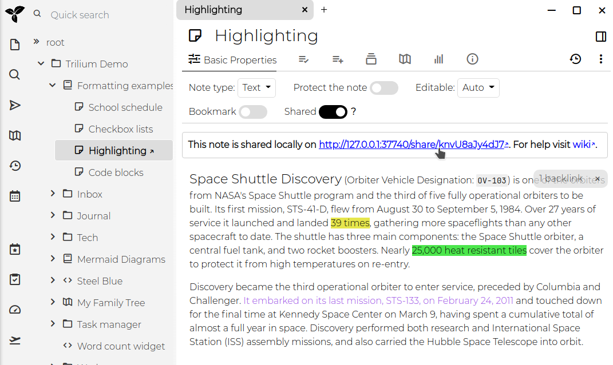

# Sharing
Trilium allows you to share selected notes as **publicly accessible** read-only documents. This feature is particularly useful for publishing content directly from your Trilium notes, making it accessible to others online.

<figure class="image"></figure>

## Features, interaction and limitations

*   Searching by note title.
*   Automatic dark/light mode based on the user's browser settings.
*   Mobile-friendly layout, with sidebar.
*   Collapsible tree with the same note icons as the application.
*   Customizable logo.
*   Toggle button for dark/light mode, which also stores the user preferences.
*   Quick navigation buttons (previous and next note).
*   Displaying the date of the last update of the note.

### By note type

<table class="ck-table-resized"><colgroup><col style="width:19.92%;"><col style="width:41.66%;"><col style="width:38.42%;"></colgroup><thead><tr><th>&nbsp;</th><th>Supported features</th><th>Limitations</th></tr></thead><tbody><tr><th><a class="reference-link" href="../Note%20Types/Text.md">Text</a></th><td><ul><li>Table of contents.</li><li>Syntax highlight of code blocks, provided a language is selected (does not work if “Auto-detected” is enabled).</li><li>Rendering for math equations.</li></ul></td><td><ul><li>Including notes is not supported.</li><li>Inline Mermaid diagrams are not rendered.</li></ul></td></tr><tr><th><a class="reference-link" href="../Note%20Types/Code.md">Code</a></th><td><ul><li>Basic support (displaying the contents of the note in a monospace font).</li></ul></td><td><ul><li>No syntax highlight.</li></ul></td></tr><tr><th><a class="reference-link" href="../Note%20Types/Saved%20Search.md">Saved Search</a></th><td>Not supported.</td><td>&nbsp;</td></tr><tr><th><a class="reference-link" href="../Note%20Types/Relation%20Map.md">Relation Map</a></th><td>Not supported.</td><td>&nbsp;</td></tr><tr><th><a class="reference-link" href="../Note%20Types/Note%20Map.md">Note Map</a></th><td>Not supported.</td><td>&nbsp;</td></tr><tr><th><a class="reference-link" href="../Note%20Types/Render%20Note.md">Render Note</a></th><td>Not supported.</td><td>&nbsp;</td></tr><tr><th><a class="reference-link" href="../Note%20Types/Collections.md">Collections</a></th><td><ul><li>The child notes are displayed in a fixed format.&nbsp;</li></ul></td><td><ul><li>More advanced view types such as the calendar view are not supported.</li></ul></td></tr><tr><th><a class="reference-link" href="../Note%20Types/Mermaid%20Diagrams.md">Mermaid Diagrams</a></th><td><ul><li>The diagram is displayed as a vector image.</li></ul></td><td><ul><li>No further interaction supported.</li></ul></td></tr><tr><th><a class="reference-link" href="../Note%20Types/Canvas.md">Canvas</a></th><td><ul><li>The diagram is displayed as a vector image.</li></ul></td><td><ul><li>No further interaction supported.</li></ul></td></tr><tr><th><a class="reference-link" href="../Note%20Types/Web%20View.md">Web View</a></th><td>Not supported.</td><td>&nbsp;</td></tr><tr><th><a class="reference-link" href="../Note%20Types/Mind%20Map.md">Mind Map</a></th><td>The diagram is displayed as a vector image.</td><td><ul><li>No further interaction supported.</li></ul></td></tr><tr><th><a class="reference-link" href="../Note%20Types/Collections/Geo%20Map%20View.md">Geo Map View</a></th><td>Not supported.</td><td>&nbsp;</td></tr><tr><th><a class="reference-link" href="../Note%20Types/File.md">File</a></th><td>Basic interaction (downloading the file).</td><td><ul><li>No further interaction supported.</li></ul></td></tr></tbody></table>

While the sharing feature is powerful, it has some limitations:

*   **Code Notes**: No syntax highlighting.
*   **Static Note Tree**
*   **Protected Notes**: Cannot be shared.
*   **Include Notes**: Not supported.

Some of these limitations may be addressed in future updates.

## Prerequisites

To use the sharing feature, you must have a <a class="reference-link" href="../Installation%20%26%20Setup/Server%20Installation.md">Server Installation</a> of Trilium. This is necessary because the notes will be hosted from the server.

## How to Share a Note

1.  **Enable Sharing**: To share a note, toggle the `Shared` switch within the note's interface. Once sharing is enabled, an URL will appear, which you can click to access the shared note.
    
    
2.  **Access the Shared Note**: The link provided will open the note in your browser. If your server is not configured with a public IP, the URL will refer to `localhost (127.0.0.1)`.

## Sharing a Note Subtree

When you share a note, you actually share the entire subtree of notes beneath it. If the note has child notes, they will also be included in the shared content. For example, sharing the "Formatting" subtree will display a page with basic navigation for exploring all the notes within that subtree.

## Viewing All Shared Notes

You can view a list of all shared notes by clicking on "Show Shared Notes Subtree." This allows you to manage and navigate through all the notes you have made public.

## Security Considerations

Shared notes are published on the open internet and can be accessed by anyone with the URL. The URL's randomness does not provide security, so it is crucial not to share sensitive information through this feature.

### Password Protection

To protect shared notes with a username and password, you can use the `#shareCredentials` attribute. Add this label to the note with the format `#shareCredentials="username:password"`. To protect an entire subtree, make sure the label is [inheritable](Attributes/Attribute%20Inheritance.md).

## Advanced Sharing Options

### Customizing the Appearance of Shared Notes

The default design should be a good starting point, but you can customize it using your own CSS:

*   **Custom CSS**: Link a CSS <a class="reference-link" href="../Note%20Types/Code.md">Code</a> note to the shared page by adding a `~shareCss` relation to the note. If you want this style to apply to the entire subtree, make the label inheritable. You can hide the CSS code note from the tree navigation by adding the `#shareHiddenFromTree` label.
*   **Omitting Default CSS**: For extensive styling changes, use the `#shareOmitDefaultCss` label to avoid conflicts with Trilium's [default stylesheet](../Basic%20Concepts%20and%20Features/Themes.md).

### Adding JavaScript

You can inject custom JavaScript into the shared note using the `~shareJs` relation. This allows you to access note attributes or traverse the note tree using the `fetchNote()` API, which retrieves note data based on its ID.

Example:

```javascript
const currentNote = await fetchNote();
const parentNote = await fetchNote(currentNote.parentNoteIds[0]);

for (const attr of parentNote.attributes) {
    console.log(attr.type, attr.name, attr.value);
}
```

### Creating Human-Readable URL Aliases

Shared notes typically have URLs like `http://domain.tld/share/knvU8aJy4dJ7`, where the last part is the note's ID. You can make these URLs more user-friendly by adding the `#shareAlias` label to individual notes (e.g., `#shareAlias=highlighting`). This will change the URL to `http://domain.tld/share/highlighting`.

**Important**:

1.  Ensure that aliases are unique.
2.  Using slashes (`/`) within aliases to create subpaths is not supported.

### Viewing and Managing Shared Notes

All shared notes are grouped under an automatically managed "Shared Notes" section. From here, you can view, share, or unshare notes by moving or cloning them within this section.


### Setting a Custom Favicon

To customize the favicon for your shared pages, create a relation `~shareFavicon` pointing to a file note containing the favicon (e.g., in `.ico` format).

### Sharing a Note as the Root

You can designate a specific note or folder as the root of your shared content by adding the `#shareRoot` label. This note will be linked when visiting `[http://domain.tld/share](http://domain/share)`, making it easier to use Trilium as a fully-fledged website. Consider combining this with the `#shareIndex` label, which will display a list of all shared notes.

## Attribute reference

<table><thead><tr><th>Attribute</th><th>Description</th></tr></thead><tbody><tr><td><code>shareHiddenFromTree</code></td><td>this note is hidden from left navigation tree, but still accessible with its URL</td></tr><tr><td><code>shareExternalLink</code></td><td>note will act as a link to an external website in the share tree</td></tr><tr><td><code>shareAlias</code></td><td>define an alias using which the note will be available under <code>https://your_trilium_host/share/[your_alias]</code></td></tr><tr><td><code>shareOmitDefaultCss</code></td><td>default share page CSS will be omitted. Use when you make extensive styling changes.</td></tr><tr><td><code>shareRoot</code></td><td>marks note which is served on /share root.</td></tr><tr><td><code>shareDescription</code></td><td>define text to be added to the HTML meta tag for description</td></tr><tr><td><code>shareRaw</code></td><td>Note will be served in its raw format, without HTML wrapper. See also&nbsp;<a class="reference-link" href="Sharing/Serving%20directly%20the%20content%20o.md">Serving directly the content of a note</a>&nbsp;for an alternative method without setting an attribute.</td></tr><tr><td><code>shareDisallowRobotIndexing</code></td><td><p>Indicates to web crawlers that the page should not be indexed of this note by:</p><ul><li>Setting the <code>X-Robots-Tag: noindex</code> HTTP header.</li><li>Setting the <code>noindex, follow</code> meta tag.</li></ul></td></tr><tr><td><code>shareCredentials</code></td><td>require credentials to access this shared note. Value is expected to be in format <code>username:password</code>. Don't forget to make this inheritable to apply to child-notes/images.</td></tr><tr><td><code>shareIndex</code></td><td>Note with this label will list all roots of shared notes.</td></tr></tbody></table>

## Credits

Since v0.95.0, a new theme was introduced (and enabled by default) which greatly improves the visual aspect of the Share feature, as well as its functionality (such as mobile support, dark/light mode, collapsible tree, etc.). This theme is an adaptation of the [Trilium Rocks!](https://github.com/zerebos/trilium.rocks) by [zerebos](https://github.com/zerebos).