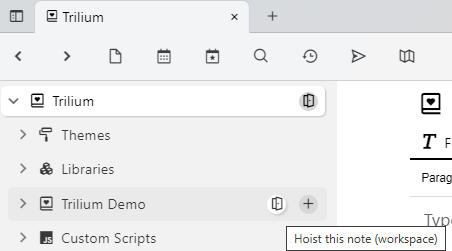

# Workspaces
Workspace is a concept built up on top of [note hoisting](Note%20Hoisting.md). It is based on the idea that a user has several distinct spheres of interest. An example might be "Personal" and "Work", these two spheres are quite distinct and don't interact together. When I focus on Work, I don't really care about personal notes.

So far workspace consists of these features:

*   [note hoisting](Note%20Hoisting.md) - you can "zoom" into a workspace subtree to focus only on the relevant notes
*   easy entering of workspace: 
    
    
*   visual identification of workspace in tabs:  
    

### Configuration

<figure class="table"><table><thead><tr><th>Label</th><th>Description</th></tr></thead><tbody><tr><td><code>workspace</code></td><td>Marks this note as a workspace, button to enter the workspace is controlled by this</td></tr><tr><td><code>workspaceIconClass</code></td><td>defines box icon CSS class which will be used in tab when hoisted to this note</td></tr><tr><td><code>workspaceTabBackgroundColor</code></td><td>CSS color used in the note tab when hoisted to this note, use any CSS color format, e.g. "lightblue" or "#ddd". See <a href="https://www.w3schools.com/cssref/css_colors.asp">https://www.w3schools.com/cssref/css_colors.asp</a>.</td></tr><tr><td><code>workspaceCalendarRoot</code></td><td>Marking a note with this label will define a new per-workspace calendar for&nbsp;<a class="reference-link" href="../../Advanced%20Usage/Advanced%20Showcases/Day%20Notes.md">Day Notes</a>. If there's no such note, the global calendar will be used.</td></tr><tr><td><code>workspaceTemplate</code></td><td>This note will appear in the selection of available template when creating new note, but only when hoisted into a workspace containing this template</td></tr><tr><td><code>workspaceSearchHome</code></td><td>new search notes will be created as children of this note when hoisted to some ancestor of this workspace note</td></tr><tr><td><code>workspaceInbox</code></td><td>default inbox location for new notes when hoisted to some ancestor of this workspace note</td></tr></tbody></table></figure>