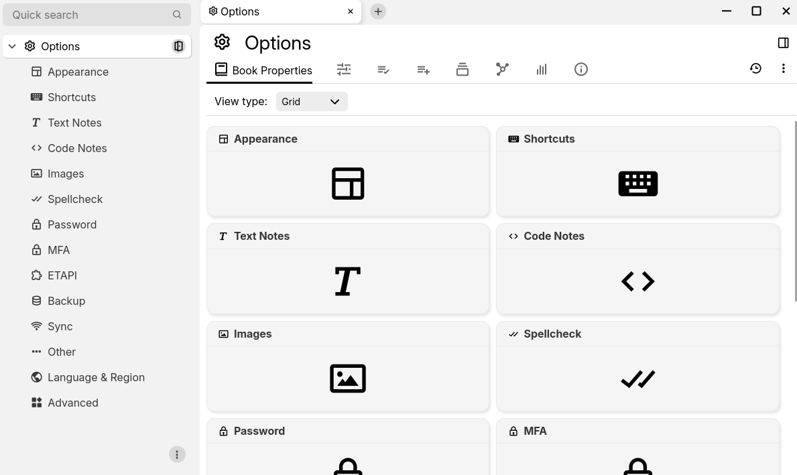

# Options
<figure class="image image-style-align-center"></figure>

The Options section allows the configuration of the TriliumNext client and server.

## Entering options

The Options can be accessed via:

*   The [Global menu](Global%20menu.md), by selecting the _Options_ item.
*   The  button in the [Launch Bar](Launch%20Bar.md) which can optionally be hidden if not desirable.
*   Optionally, a keyboard shortcut can be defined, but it is not assigned by default.
*   By clicking on this link: <a class="reference-link" href="#root/_hidden/_options">Options</a>.

Once in the options section, simply select one of the option categories using the <a class="reference-link" href="Note%20Tree.md">Note Tree</a>.

## Exiting options

When entering the options, they are opened in a new [tab](Tabs.md). To close them, simply close the tab.

## Options when using sync

When using <a class="reference-link" href="../../Installation%20%26%20Setup/Synchronization.md">Synchronization</a>, some of the options will be kept in sync across all the devices while others can be changed independently.

Generally, the options that relate to appearance are intentionally kept not synced in order to allow per-client customization (layout orientation, theme, vertical/horizontal layout, code block themes).