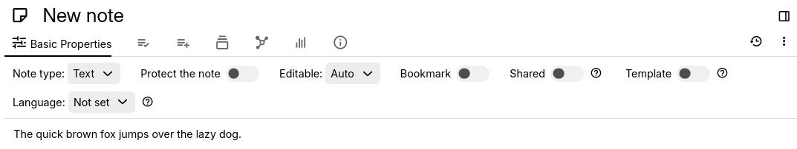

# Ribbon

The ribbon allows changing options, attributes and viewing information about the current note.

## Settings

It is possible to change whether some ribbon items will be automatically open when navigating to a new note. To do so, in [Settings](Options.md), go to _Appearance_ and look for the _Ribbon widgets_ section.

## Formatting

If you are using the _Fixed_ formatting toolbar, all the formatting buttons for text notes will appear here. See [Formatting toolbar](../../Note%20Types/Text/Formatting%20toolbar.md) for more information.

## Tabs

### Basic Properties

*   _**Note type**_ allows changing the [note type](../../Note%20Types) of a note.
    *   Generally this is desirable only if the note is empty.
    *   As a more advanced use, it's possible to change the note type in order to modify the [source code](../../Advanced%20Usage/Note%20source.md) of a note.
*   _**Protect the note**_ toggles whether the current note is encrypted and accessible only by entering the protected session. See [Protected Notes](../Notes/Protected%20Notes.md) for more information.
*   _**Editable**_ changes whether the current note:
    *   Enters [read-only mode](../Notes/Read-Only%20Notes.md) automatically if the note is too big (default behaviour).
    *   Is always in read-only mode (however it can still be edited temporarily).
    *   Is always editable, regardless of its size.
*   _**Bookmark**_ toggles the display of the current note into the [Launch Bar](Launch%20Bar.md) for easy access. See [Bookmarks](../Navigation/Bookmarks.md) for more information.
*   _**Shared**_ toggles whether the current note is publicly accessible if you have a [server instance](../../Installation%20%26%20Setup/Server%20Installation.md) set up. See [Sharing](../../Advanced%20Usage/Sharing.md) for more information.
*   _**Template**_ toggles whether the current note is considered a template and can be used to easily create notes with the same content. See [Template](../../Advanced%20Usage/Attributes/Template.md) for more information.
*   _**Language**_ changes the main language of the current note, mostly useful for spell checking or right-to-left support. See [Content language & Right-to-left support](../../Note%20Types/Text/Content%20language%20%26%20Right-to-le.md) for more information.

### Owned Attributes

This section allows editing the labels and relations of a note. For more information, see [Attributes](../../Advanced%20Usage/Attributes.md).

The plus button to the right offers a simplified way to insert labels and relations, via a graphical input. From this menu, it's also possible to define label and relation definitions (see [Promoted Attributes](../../Advanced%20Usage/Attributes/Promoted%20Attributes.md)).

### Inherited Attributes

This section displays the attributes which are applied to this note via [Attribute Inheritance](../../Advanced%20Usage/Attributes/Attribute%20Inheritance.md). It is not possible to alter the attributes from this section.

### Note Paths

This section displays all the places where the current note has been cloned to. Here the current note can also be cloned to a new location (similar to the [Note Tree](Note%20Tree.md)) See [Cloning Notes](../Notes/Cloning%20Notes.md) for more information.

### Note Map

The note map displays all the relations of the current note to other notes, as well as the subtree structure. See [Note Tree](Note%20Tree.md) for more information.

### Similar Notes

This section lists all the notes that are similar to the current one. See [Similar Notes](../Navigation/Similar%20Notes.md) for more information.

### Note Info

This section displays information about the current note:

*   The [internal ID](../../Advanced%20Usage/Note%20ID.md) of the note.
*   The [type of the note](../../Note%20Types), as well as its MIME type (used mostly for exporting notes).
*   The created and modification dates.
*   The estimated size of the note in the [Database](../../Advanced%20Usage/Database.md), as well as its children count and size.

### Edited notes

This section pops automatically when entering a [day note](../../Advanced%20Usage/Advanced%20Showcases/Day%20Notes.md) and shows the notes that were edited that day.