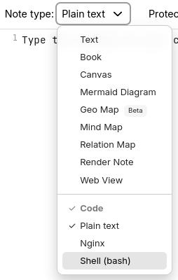

# Code
Trilium supports creating "code" notes, i.e. notes which contain some sort of formal code - be it programming language (C++, JavaScript), structured data (JSON, XML) or other types of codes (CSS etc.).

This can be useful for a few things:

*   computer programmers can store code snippets as notes with syntax highlighting
*   JavaScript code notes can be executed inside Trilium for some extra functionality
    *   we call such JavaScript code notes "scripts" - see <a class="reference-link" href="../Scripting.md">Scripting</a>
*   JSON, XML etc. can be used as storage for structured data (typically used in conjunction with scripting)

For shorter snippets of code that can be embedded in [Text](Text.md) notes, see [Code blocks](Text/Developer-specific%20formatting/Code%20blocks.md).

## Adjusting the language of a code note

In the [Ribbon](../Basic%20Concepts%20and%20Features/UI%20Elements/Ribbon.md), look for the _Note type_ selector and click it to reveal the possible note types. Inside of it there will be a section called _Code_, select any one of the languages.

## Adjusting the list of languages

Trilium supports syntax highlighting for many languages, but by default displays only some of them. The supported languages can be adjusted by going to [Options](../Basic%20Concepts%20and%20Features/UI%20Elements/Options.md), then _Code Notes_ and looking for the _Available MIME types in the dropdown_ section. Simply check any of the items to add them to the list, or un-check them to remove them from the list.

Note that the list of languages is not immediately refreshed, you'd have to manually [refresh the application](../Troubleshooting/Refreshing%20the%20application.md).

The list of languages is also shared with the [Code blocks](Text/Developer-specific%20formatting/Code%20blocks.md) feature of [Text](Text.md) notes.