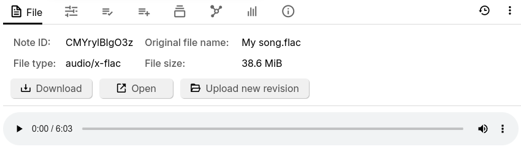
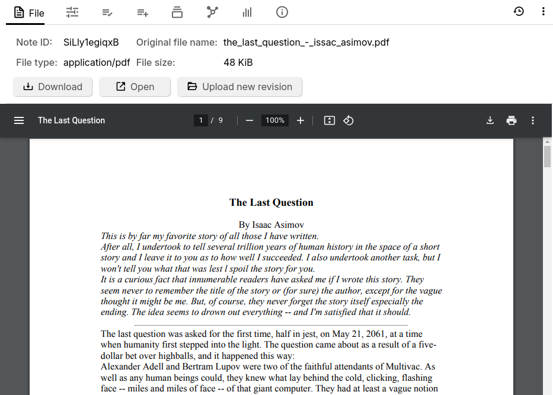
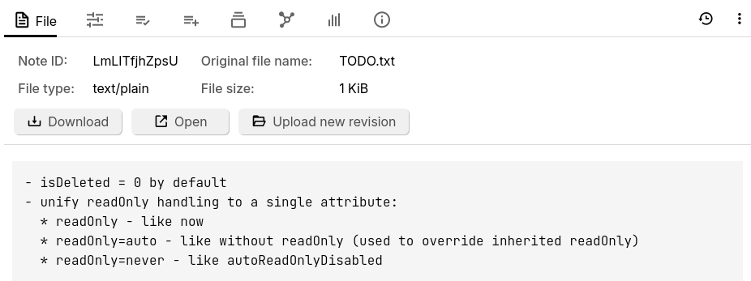
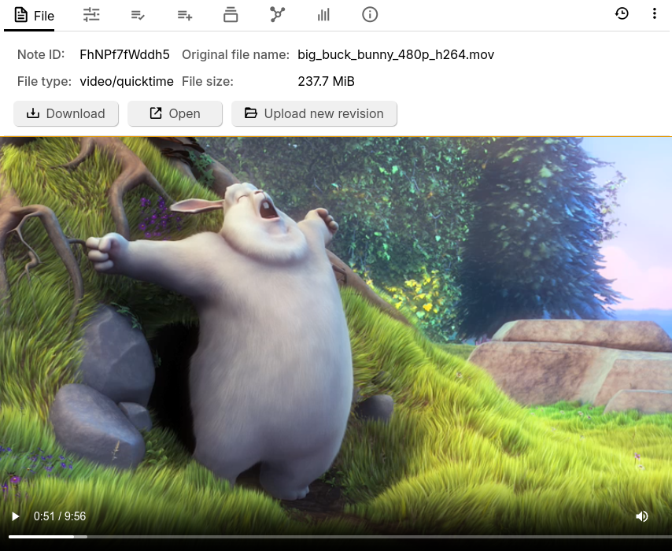
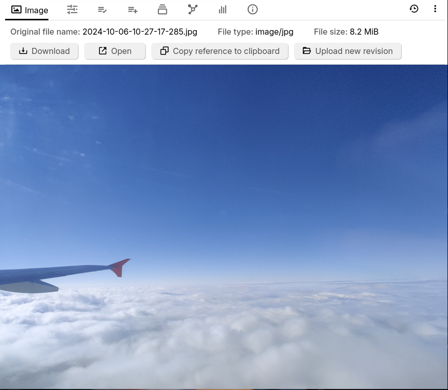
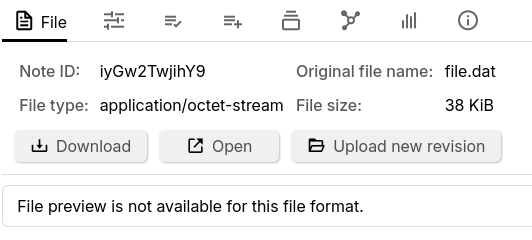

# File
The _File_ note type can be used to attach various external files such as images, videos or PDF documents.

## Uploading a file

Since these files come from an external source, it is not possible to create a _File_ note type directly:

*   Drag a file into the <a class="reference-link" href="../Basic%20Concepts%20and%20Features/UI%20Elements/Note%20Tree.md">Note Tree</a>.
*   Right click a note and select _Import into note_ and point it to one of the supported files.

## Supported file types

### PDFs

See <a class="reference-link" href="File/PDFs.md">PDFs</a>.

### Images

<figure class="image image-style-align-center image_resized" style="width:50%;"></figure>

Interaction:

*   _Copy reference to clipboard_, for embedding the image within <a class="reference-link" href="Text.md">Text</a> notes.
    *   See <a class="reference-link" href="Text/Images/Image%20references.md">Image references</a> for more information.
    *   Alternatively, press the corresponding button from the <a class="reference-link" href="../Basic%20Concepts%20and%20Features/UI%20Elements/Floating%20buttons.md">Floating buttons</a>.

### Videos

<figure class="image image-style-align-center image_resized" style="width:50%;"></figure>

Video files can be added in as well. The file is streamed directly, so when accessing the note from a server it doesn't have to download the entire video to start playing it.

> [!CAUTION]
> Although Trilium offers support for videos, it is generally not meant to be used with very large files. Uploading large videos will cause the <a class="reference-link" href="../Advanced%20Usage/Database.md">Database</a> to balloon as well as the any <a class="reference-link" href="../Installation%20%26%20Setup/Backup.md">Backup</a> of it. In addition to that, there might be slowdowns when first uploading the files. Otherwise, a large database should not impact the general performance of Trilium significantly.

### Audio

<figure class="image image-style-align-center image_resized" style="width:50%;"></figure>

Adding a supported audio file will reveal a basic audio player that can be used to play it.

Interactions:

*   The audio can be played/paused using the dedicated button.
*   Dragging the mouse across, or clicking the progress bar will seek through the song.
*   The volume can be set.
*   The playback speed can be adjusted via the contextual menu next to the volume.

### Text files

<figure class="image image-style-align-center image_resized" style="width:50%;"></figure>

Files that are identified as containing text will show a preview of their content. One common use case for this type of file is to embed text files whose content is not necessarily of interest to the user, such as third-party libraries or generated content, that can then be downloaded if needed.

Note that generally text files will be [imported](../Basic%20Concepts%20and%20Features/Import%20%26%20Export.md) as either <a class="reference-link" href="Text.md">Text</a> or <a class="reference-link" href="Code.md">Code</a> notes. To bypass this behavior and create a _File_ note type, use the _Import into note_ feature and uncheck _Import HTML, Markdown and TXT as text notes_, as well as _Import recognized code files as code notes_. 

Since one of the use cases for having files instead of notes is to display large files, the content preview is limited to a relatively small amount of characters. To view the full file, consider opening it in an external application.

### Unknown file types

<figure class="image image-style-align-center image_resized" style="width:50%;"></figure>

If the file could not be identified as any of the supported file types from above, it will be treated as an unknown file. In this case, all the default interactions will be available such as downloading or opening the file externally, but there will be no preview of the content.

## Interaction

*   Regardless of the file type, a series of buttons will be displayed in the _Image_ or _File_ tab in the <a class="reference-link" href="../Basic%20Concepts%20and%20Features/UI%20Elements/Ribbon.md">Ribbon</a>.
    *   _Download_, which will download the file for local use.
    *   _Open_, will will open the file with the system-default application.
    *   Upload new revision to replace the file with a new one.
*   It is **not** possible to change the note type of a _File_ note.
*   Convert into an [attachment](../Basic%20Concepts%20and%20Features/Notes/Attachments.md) from the [note menu](../Basic%20Concepts%20and%20Features/UI%20Elements/Note%20buttons.md).

## Relation with other notes

*   Files are also displayed in the <a class="reference-link" href="../Basic%20Concepts%20and%20Features/Notes/Note%20List.md">Note List</a> based on their type:
    
    
*   Non-image files can be embedded into text notes as read-only widgets via the <a class="reference-link" href="Text/Include%20Note.md">Include Note</a> functionality.
*   Image files can be embedded into text notes like normal images via <a class="reference-link" href="Text/Images/Image%20references.md">Image references</a>.