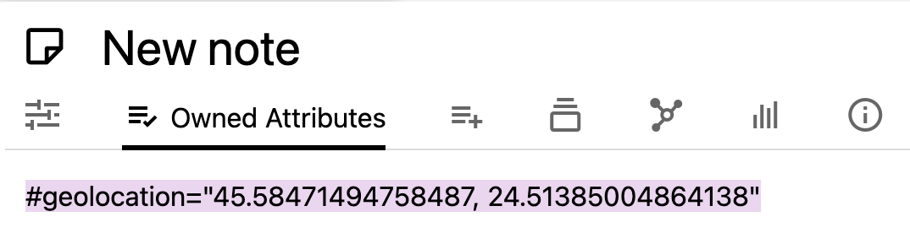
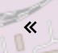
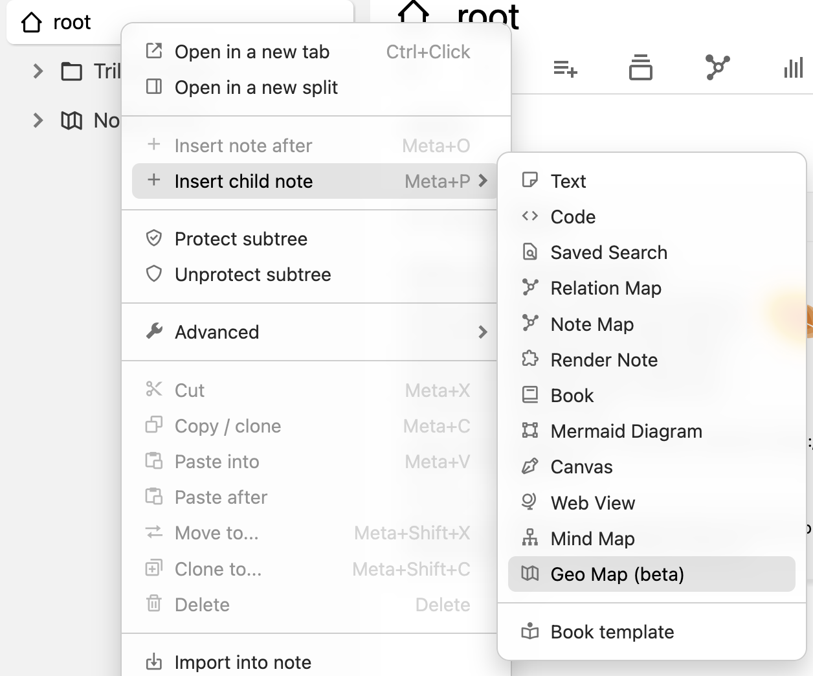
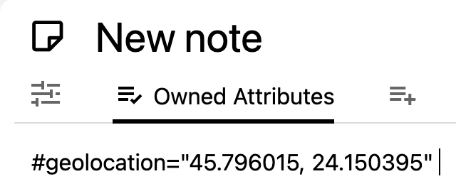
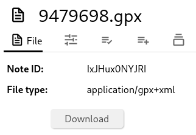

# Geo map
## Creating a new geo map

|     |     |     |
| --- | --- | --- |  
| 1   |  | Right click on any note on the note tree and select _Insert child note_ → _Geo Map (beta)_. |
| 2   |  | By default the map will be empty and will show the entire world. |

## Repositioning the map

*   Click and drag the map in order to move across the map.
*   Use the mouse wheel, two-finger gesture on a touchpad or the +/- buttons on the top-left to adjust the zoom.

The position on the map and the zoom are saved inside the map note and restored when visiting again the note.

## Adding a marker using the map

|     |     |     |
| --- | --- | --- |  
| 1   |     | To create a marker, first navigate to the desired point on the map. Then press the button on the top-right of the map.  If the button is not visible, make sure the button section is visible by pressing the chevron button ( ) in the top-right of the map. |
| 2   |  | Once pressed, the map will enter in the insert mode, as illustrated by the notification.  Simply click the point on the map where to place the marker, or the Escape key to cancel. |
| 3   |  | Enter the name of the marker/note to be created. |
| 4   |  | Once confirmed, the marker will show up on the map and it will also be displayed as a child note of the map. |

## How the location of the markers is stored

The location of a marker is stored in the `#geolocation` attribute of the child notes:

This value can be added manually if needed. The value of the attribute is made up of the latitude and longitude separated by a comma.

## Repositioning markers

It's possible to reposition existing markers by simply drag and dropping them to the new destination.

As soon as the mouse is released, the new position is saved.

If moved by mistake, there is currently no way to undo the change. If the mouse was not yet released, it's possible to force a refresh of the page (Ctrl+R or Meta+R) to cancel it.

## Interaction with the markers

*   Hovering over a marker will display the content of the note it belongs to.
    *   Clicking on the note title in the tooltip will navigate to the note in the current view.
*   Middle-clicking the marker will open the note in a new tab.
*   Right-clicking the marker will open a contextual menu allowing:
    *   Opening the note in a new tab, split or window.
    *   Opening the location using an external application (if the operating system supports it).
    *   Removing the marker from the map, which will remove the `#geolocation` attribute of the note. To add it back again, the coordinates have to be manually added back in.

## Icon and color of the markers

The markers will have the same icon as the note.

It's possible to add a custom color to a marker by assigning them a `#color` attribute such as `#color=green`.

## Adding the coordinates manually

In a nutshell, create a child note and set the `#geolocation` attribute to the coordinates.

The value of the attribute is made up of the latitude and longitude separated by a comma.

### Adding from Google Maps

|     |     |     |
| --- | --- | --- |
| 1   |  | Go to Google Maps on the web and look for a desired location, right click on it and a context menu will show up.  Simply click on the first item displaying the coordinates and they will be copied to clipboard.  Then paste the value inside the text box into the `#geolocation` attribute of a child note of the map (don't forget to surround the value with a `"` character). |
| 2   |  | In Trilium, create a child note under the map. |
| 3   |  | And then go to Owned Attributes and type `#geolocation="`, then paste from the clipboard as-is and then add the ending `"` character. Press Enter to confirm and the map should now be updated to contain the new note. |

### Adding from OpenStreetMap

Similarly to the Google Maps approach:

|     |     |     |
| --- | --- | --- |  
| 1   |  | Go to any location on openstreetmap.org and right click to bring up the context menu. Select the “Show address” item. |
| 2   |  | The address will be visible in the top-left of the screen, in the place of the search bar.  Select the coordinates and copy them into the clipboard. |
| 3   |  | Simply paste the value inside the text box into the `#geolocation` attribute of a child note of the map and then it should be displayed on the map. |

## Adding GPS tracks (.gpx)

Trilium has basic support for displaying GPS tracks on the geo map.

|     |     |     |
| --- | --- | --- |  
| 1   |  | To add a track, simply drag & drop a .gpx file inside the geo map in the note tree. |
| 2   |  | In order for the file to be recognized as a GPS track, it needs to show up as `application/gpx+xml` in the _File type_ field. |
| 3   |  | When going back to the map, the track should now be visible.  The start and end points of the track are indicated by the two blue markers. |

## Troubleshooting

### Grid-like artifacts on the map

This occurs if the application is not at 100% zoom which causes the pixels of the map to not render correctly due to fractional scaling. The only possible solution is to set the UI zoom at 100% (default keyboard shortcut is Ctrl+0).