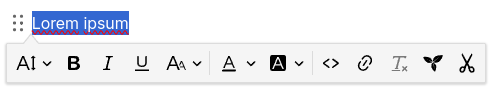

# Text
The default note type in Trilium, text notes allow for rich formatting, tables, images, admonitions and a handful of other features.

## Formatting bars

Most of the interaction with text notes is done via the built-in toolbars. Depending on preference, there are two different layouts:

*   The _Floating toolbar_ is hidden by default and only appears when needed. In this mode there are actually two different toolbars:  
    
*   A toolbar that appears when text is selected. This provides text-level formatting such as bold, italic, text colors, inline code, etc.  
    __

Fore more information see <a class="reference-link" href="Text/Formatting%20toolbar.md">Formatting toolbar</a>.

## Features and formatting

Here's a list of various features supported by text notes:

<figure class="table"><table><thead><tr><th>Dedicated article</th><th>Feature</th></tr></thead><tbody><tr><td><a class="reference-link" href="Text/General%20formatting.md">General formatting</a></td><td><ul><li>Headings (section titles, paragraph)</li><li>Font size</li><li>Bold, italic, underline, strike-through</li><li>Superscript, subscript</li><li>Font color &amp; background color</li><li>Remove formatting</li></ul></td></tr><tr><td><a class="reference-link" href="Text/Lists.md">Lists</a></td><td><ul><li>Bulleted lists</li><li>Numbered lists</li><li>To-do lists</li></ul></td></tr><tr><td><a class="reference-link" href="Text/Block%20quotes%20%26%20admonitions.md">Block quotes &amp; admonitions</a></td><td><ul><li>Block quotes</li><li>Admonitions</li></ul></td></tr><tr><td><a class="reference-link" href="Text/Tables.md">Tables</a></td><td><ul><li>Basic tables</li><li>Merging cells</li><li>Styling tables and cells.</li><li>Table captions</li></ul></td></tr><tr><td><a class="reference-link" href="Text/Developer-specific%20formatting.md">Developer-specific formatting</a></td><td><ul><li>Inline code</li><li>Code blocks</li><li>Keyboard shortcuts</li></ul></td></tr><tr><td><a class="reference-link" href="Text/Footnotes.md">Footnotes</a></td><td><ul><li>Footnotes</li></ul></td></tr><tr><td><a class="reference-link" href="Text/Images.md">Images</a></td><td><ul><li>Images</li></ul></td></tr><tr><td><a class="reference-link" href="Text/Links.md">Links</a></td><td><ul><li>External links</li><li>Internal Trilium links</li></ul></td></tr><tr><td><a class="reference-link" href="Text/Include%20Note.md">Include Note</a></td><td><ul><li>Include note</li></ul></td></tr><tr><td><a class="reference-link" href="Text/Insert%20buttons.md">Insert buttons</a></td><td><ul><li>Symbols</li><li><a class="reference-link" href="Text/Math%20Equations.md">Math Equations</a></li><li>Mermaid diagrams</li><li>Horizontal ruler</li><li>Page break</li></ul></td></tr><tr><td><a class="reference-link" href="Text/Other%20features.md">Other features</a></td><td><ul><li>Indentation</li><li>Markdown import</li><li><a class="reference-link" href="Text/Cut%20to%20subnote.md">Cut to subnote</a></li></ul></td></tr></tbody></table></figure>

## Read-Only vs. Editing Mode

Text notes are usually opened in edit mode. However, they may open in read-only mode if the note is too big or the note is explicitly marked as read-only. For more information, see <a class="reference-link" href="../Basic%20Concepts%20and%20Features/Notes/Read-Only%20Notes.md">Read-Only Notes</a>.

## Keyboard shortcuts

There are numerous keyboard shortcuts to format the text without having to use the mouse. For a reference of all the key combinations, see <a class="reference-link" href="../Basic%20Concepts%20and%20Features/Keyboard%20Shortcuts.md">Keyboard Shortcuts</a>. In addition, see <a class="reference-link" href="Text/Markdown-like%20formatting.md">Markdown-like formatting</a> as an alternative to the keyboard shortcuts.

## Technical details

For the text editing functionality, Trilium uses a commercial product (with an open-source base) called <a class="reference-link" href="../Advanced%20Usage/Technologies%20used/CKEditor.md">CKEditor</a>. This brings the benefit of having a powerful WYSIWYG (What You See Is What You Get) editor.