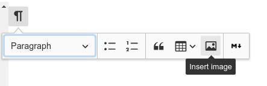
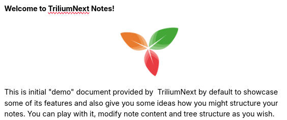
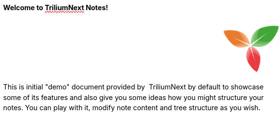

# Images
Trilium supports storing and displaying images. Supported formats are JPEG, PNG and GIF.

An image can be uploaded in the form of note's [attachment](../../Basic%20Concepts%20and%20Features/Notes/Attachments.md) or as a standalone [note](../../Basic%20Concepts%20and%20Features/Navigation/Tree%20Concepts.md) placed into the [note tree](../../Basic%20Concepts%20and%20Features/Navigation/Tree%20Concepts.md). Its reference can be copied into a text note, in order to display it in the text itself.

## Uploading images

To add an image to the note, simply drag it from file explorer onto the note editor inside Trilium and the image will be uploaded.

Alternatively you can click on block toolbar and then on "Insert image":

You can also copy and paste an image from web - the image will be (asynchronously) downloaded and embedded.

## Configuring the images

Clicking on an image will reveal a popup with multiple options:  

### Alignment

The first set of options configure the alignment are, in order:

<figure class="table"><table><thead><tr><th>Icon</th><th>Option</th><th>Preview</th><th>Description</th></tr></thead><tbody><tr><td></td><td>Inline</td><td></td><td>As the name suggests, the name can be put inside a paragraph and moved around similarly as if it was a block of text. Use drag &amp; drop or cut-paste to move it around.</td></tr><tr><td></td><td>Centered image</td><td></td><td>The image will be displayed as a block and centered, not allowing text in either the left or right of it.</td></tr><tr><td></td><td>Wrap text</td><td></td><td>The image will be displayed to the left or the right of the text.</td></tr><tr><td></td><td>Block align</td><td></td><td>Similarly to <em>Centered image</em>, the image will be displayed as a block and aligned either to the left or to the right, but not allowing text to flow on either of its sides.</td></tr></tbody></table></figure>

## Compression

Since Trilium isn't really meant to be primary storage for image data, it attempts to compress and resize (with pretty aggressive settings) uploaded images before storing them to the database. You may then notice some quality degradation. Basic quality settings is available in <a class="reference-link" href="../../Basic%20Concepts%20and%20Features/UI%20Elements/Options.md">Options</a> → Other.

If you want to save images in their original resolution, it is recommended to save them as attachment to note (look for the contextual menu in <a class="reference-link" href="../../Basic%20Concepts%20and%20Features/UI%20Elements/Note%20buttons.md">Note buttons</a> → _Import files_).

## Aligning images side-by-side

There are generally two ways to display images side by side:

*   If they are roughly the same size, simply make the two images in-line, according to the alignment section above. The images can be dragged & dropped onto the same line.
*   If they are on different size, create a [table](Tables.md) with invisible borders.