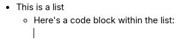

# Lists
There are three types of lists supported by text notes:

*   Bulleted lists (also known as unordered lists).
*   Numbered lists (or ordered lists).
*   To-do lists

## Keyboard shortcuts

*   Bulleted list: Start a line with `*` or `-` followed by a space;
*   Numbered list: Start a line with `1.` or `1)` followed by a space;
*   To-do list: Start a line with `[ ]` for an unchecked item or `[x]` for a checked item.

## Headings, code blocks within lists

It possible to add content-level blocks such as headings, code blocks, tables within lists, as follows:

|     |     |
| --- | --- |
|  | First, create a list. |
|  | Press Enter to create a new list item. |
|  | Press Backspace to get rid of the bullet point. Notice the cursor position. |
|  | At this point, insert any desired block-level item such as a code block. |
|  | To continue with a new bullet point, press Enter until the cursor moves to a new blank position. |
|  | Press Enter once more to create the new bullet. |

The same principle applies to all three list types (bullet, numbered and to-do).