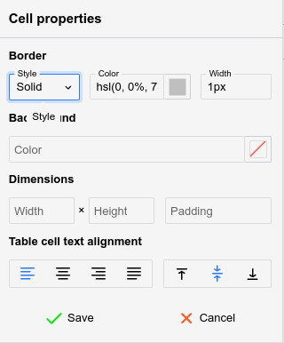

# Tables
Tables are a powerful feature for <a class="reference-link" href="../Text.md">Text</a> notes, since editing them is generally easy.

<figure class="image image-style-align-right"></figure>

To create a table, simply press the table button and select with the mouse the desired amount of columns and rows, as indicated in the adjacent figure.

## Formatting toolbar

When a table is selected, a special formatting toolbar will appear:

## Navigating a table

*   Using the mouse:
    *   Click on a cell to focus it.
    *   Click the  button at the top or the bottom of a table to insert an empty paragraph near it.
    *   Click the  button at the top-left of the table to select it entirely (for easy copy-pasting or cutting) or drag and drop it to relocate the table.
*   Using the keyboard:
    *   Use the arrow keys on the keyboard to easily navigate between cells.
    *   It's also possible to use <kbd>Tab</kbd> to go to the next cell and Shift+Tab to go to the previous cell.
    *   Unlike arrow keys, pressing <kbd>Tab</kbd> at the end of the table (last row, last column) will create a new row automatically.
    *   To select multiple cells, hold <kbd>Shift</kbd> while using the arrow keys.

## Resizing cells

*   Columns can be resized by hovering the mouse over the border of two adjacent cells and dragging it.
*   By default, the row height is not adjustable using the mouse, but it can be configured from the cell settings (see below).
*   To adjust exactly the width (in pixels or percentages) of a cell, select the  button.

## Inserting new rows and new columns

*   To insert a new column, click on a desired location, then press the  button from the formatting toolbar and select _Insert column left or right._
*   To insert a new row, click on a desired location, then press the  button and select _Insert row above_ or _below_.
    *   A quicker alternative to creating a new row while at the end of the table is to press the <kbd>Tab</kbd> key.

## Merging cells

To merge two or more cells together, simply select them via drag & drop and press the  button from the formatting toolbar.

More options are available by pressing the arrow next to it:

*   Click on a single cell and select Merge cell up/down/right/left to merge with an adjacent cell.
*   Select _Split cell vertically_ or _horizontally_, to split a cell into multiple cells (can also be used to undo a merge).

## Table properties

<figure class="image image-style-align-right"></figure>

The table properties can be accessed via the  button and allows for the following adjustments:

*   Border (not the border of the cells, but the outer rim of the table), which includes the style (single, double), color and width.
*   The background color, with none set by default.
*   The width and height of the table in percentage (must end with `%`) or pixels (must end with `px`).
*   The alignment of the table.
    *   Left or right-aligned, case in which the text will flow next to it.
    *   Centered, case in which text will avoid the table, regardless of the table width.

The table will immediately update to reflect the changes, but the _Save_ button must be pressed for the changes to persist.

## Cell properties

<figure class="image image-style-align-right"></figure>

Similarly to table properties, the  button opens a popup which adjusts the styling of one or more cells (based on the user's selection).

The following options can be adjusted:

*   The border style, color and width (same as table properties), but applying to the current cell only.
*   The background color, with none set by default.
*   The width and height of the cell in percentage (must end with `%`) or pixels (must end with `px`).
*   The padding (the distance of the text compared to the cell's borders).
*   The alignment of the text, both horizontally (left, centered, right, justified) and vertically (top, middle or bottom).

The cell will immediately update to reflect the changes, but the _Save_ button must be pressed for the changes to persist.

## Caption

Press the  button to insert a caption or a text description of the table, which is going to be displayed above the table.

## Tables with invisible borders

Tables can be set to have invisible borders in order to allow for basic layouts (columns, grids) of text or [images](Images.md) without the distraction of their border:

1.  First insert a table with the desired number of columns and rows.
2.  Select the entire table.
3.  In _Table properties_, set:
    1.  _Style_ to _Single_
    2.  _Color_ to `transparent`
    3.  Width to `1px`.
4.  In Cell Properties, set the same as on the previous step.

## Markdown import/export

Simple tables are exported in GitHub-flavored Markdown format (e.g. a series of `|` items). If the table is found to be more complex (it contains HTML elements, has custom sizes or images), the table is converted to a HTML one instead.

Generally formatting loss should be minimal when exported to Markdown due to the fallback to HTML formatting.