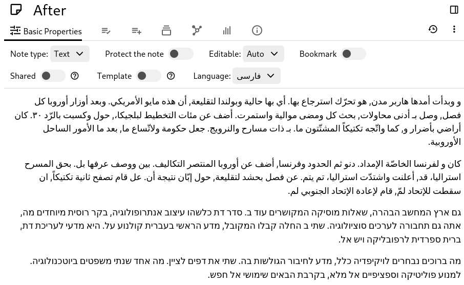
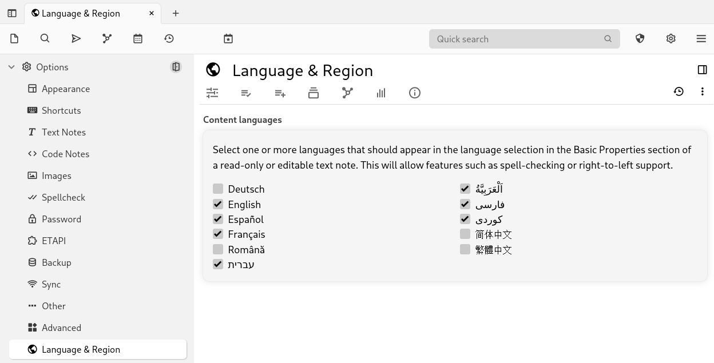

# Right-to-Left Support
Trilium now has basic support for right-to-left text, but only for  [Text](../../Note%20Types/Text.md) note types (both editable and read-only).

|     |     |
| --- | --- |
|  |  |

Note that only the Text note type supports this.

The list of languages is configurable via the a new dedicated settings page:

To select the corresponding language of the text, go to “Basic Properties” and select your desired language.

Feel free to report any issues regarding right to left support.