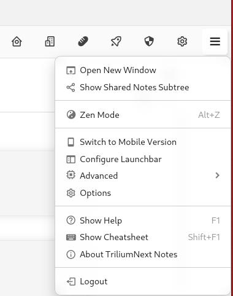

# Global menu
The position of the global menu differs based on which layout is selected in settings:

*   For the vertical layout, the icon is in the top-left of the screen, in the form of the Trilium icon.
*   For the horizontal layout, the icon is in the top-right of the screen, in form of a hamburger menu icon.

|     |     |
| --- | --- |
|   The global menu in the vertical layout. |   The global menu in the horizontal layout. |