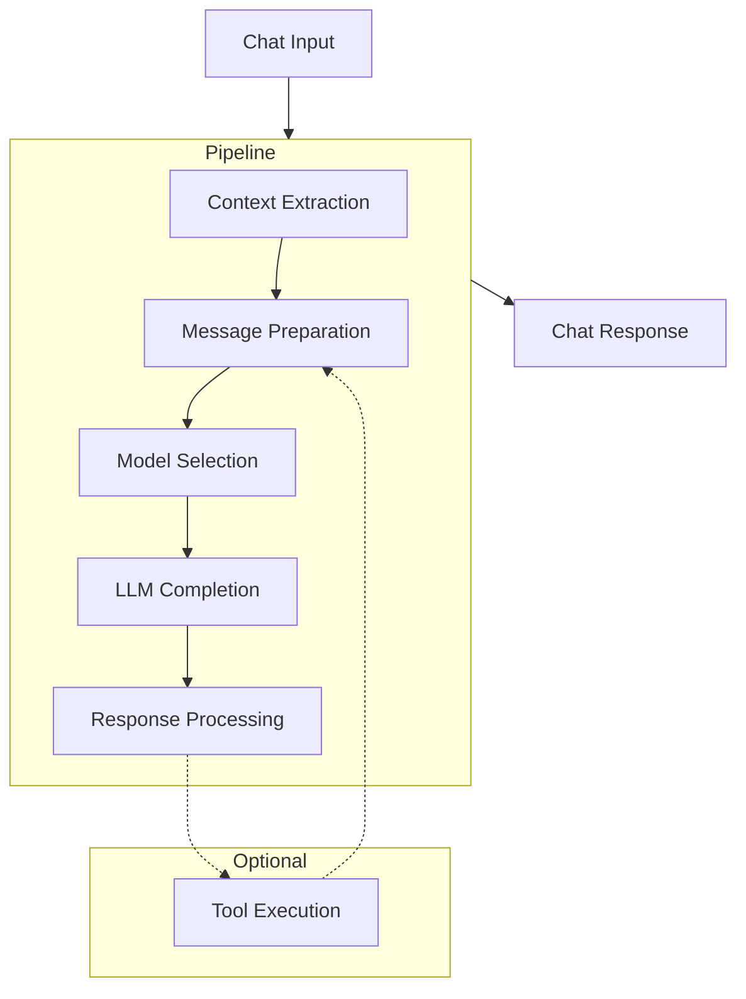
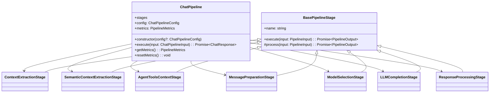
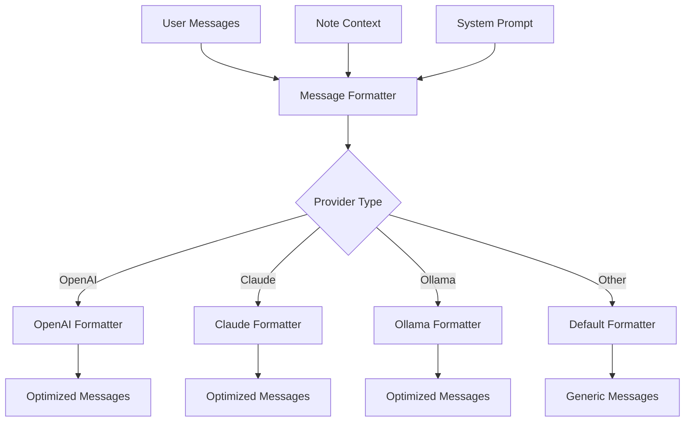
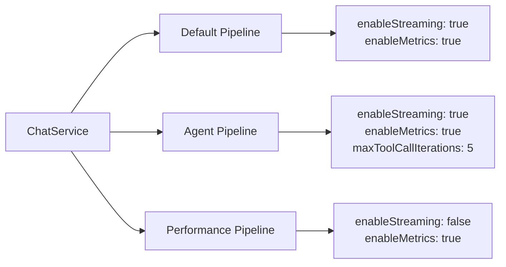
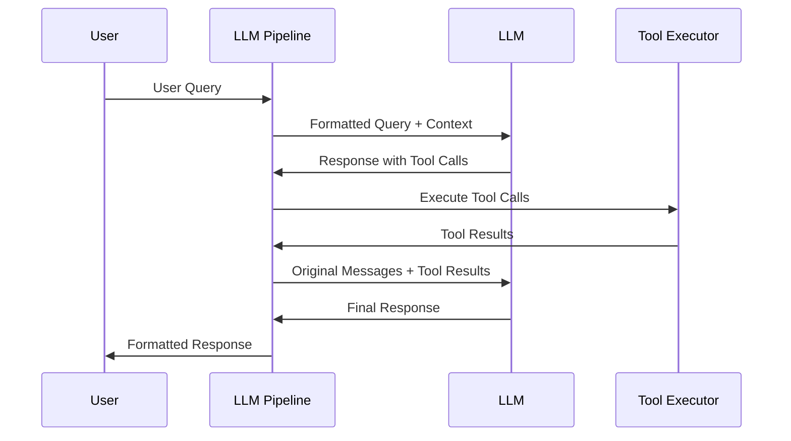

# Trilium LLM Pipeline Documentation

This document provides an overview of the LLM Pipeline architecture in Trilium Notes, explains the data flow, and provides instructions for extending the pipeline with new providers or stages.

## Overview

The LLM Pipeline is a modular architecture that handles the flow of data for LLM chat interactions in Trilium Notes. It breaks down the complex process of context retrieval, message preparation, model selection, completion generation, and response processing into separate, reusable stages.

## Pipeline Data Flow



## Pipeline Architecture

The pipeline is composed of modular stages that can be configured for different use cases:



## Pipeline Stages

Each stage in the pipeline has a specific responsibility:

1. **Context Extraction**: Retrieves relevant context from notes based on user query
2. **Message Preparation**: Formats messages with context in provider-specific way
3. **Model Selection**: Chooses appropriate model based on query complexity
4. **LLM Completion**: Generates completion using the selected provider and model
5. **Response Processing**: Post-processes the response (handles "thinking" output, formats markdown, etc.)

## Provider-Specific Message Formatting

Different LLM providers handle context in different ways for optimal performance:



## Multiple Pipeline Configurations

The chat service now supports multiple pipeline configurations for different use cases:



## Adding a New LLM Provider

To add a new LLM provider to Trilium, follow these steps:

### 1. Implement the AIService Interface

Create a new file in `src/services/llm/providers/your_provider_service.ts`:

```typescript
import type { Message, ChatCompletionOptions, ChatResponse, AIService } from '../ai_interface.js';
import log from '../../log.js';
import options from '../../options.js';

export class YourProviderService implements AIService {
    async generateChatCompletion(messages: Message[], options?: ChatCompletionOptions): Promise<ChatResponse> {
        // Implement API call to your provider
        // Return response in standardized format
        return {
            text: "Response text from your provider",
            model: options?.model || "default-model",
            provider: "your-provider-name"
        };
    }

    isAvailable(): boolean {
        // Check if API key or other required config exists
        const apiKey = options.getOption('yourProviderApiKey');
        return !!apiKey;
    }

    getName(): string {
        return 'your-provider-name';
    }
}
```

### 2. Create a Message Formatter

Create a custom message formatter in `src/services/llm/pipeline/interfaces/message_formatter.ts`:

```typescript
export class YourProviderMessageFormatter extends BaseMessageFormatter {
    formatMessages(messages: Message[], systemPrompt?: string, context?: string): Message[] {
        // Format messages optimally for your provider
        const formattedMessages: Message[] = [];
        
        // Add system message
        if (systemPrompt) {
            formattedMessages.push({
                role: 'system',
                content: systemPrompt
            });
        }
        
        // Format context according to provider's best practices
        if (context) {
            // Example: Add context in provider-specific format
            formattedMessages.push({
                role: 'user',
                content: `Reference information: ${context}`
            });
        }
        
        // Add the rest of messages
        formattedMessages.push(...this.getMessagesWithoutSystem(messages));
        
        return formattedMessages;
    }
}

// Register your formatter with the factory
MessageFormatterFactory.registerFormatter('your-provider-name', new YourProviderMessageFormatter());
```

### 3. Register the Provider in AIServiceManager

Update `src/services/llm/ai_service_manager.ts`:

```typescript
import { YourProviderService } from './providers/your_provider_service.js';

// Add your provider to the services object
private services: Record<ServiceProviders, AIService> = {
    openai: new OpenAIService(),
    anthropic: new AnthropicService(),
    ollama: new OllamaService(),
    'your-provider-name': new YourProviderService()
};

// Add it to the default provider order
private providerOrder: ServiceProviders[] = ['openai', 'anthropic', 'ollama', 'your-provider-name'];
```

### 4. Add Provider Settings to Options

In the appropriate UI file, add settings for your provider:

```typescript
// Example settings
{
    name: 'yourProviderApiKey',
    value: '',
    isSensitive: true
},
{
    name: 'yourProviderDefaultModel',
    value: 'default-model-name'
}
```

## Using the Pipeline via ChatService

The ChatService now provides a unified `processMessage` method for all chat interactions:

```typescript
import chatService from '../services/llm/chat_service.js';

// Process a regular message
const session = await chatService.processMessage(
    'session-id', 
    'What can you tell me about this note?', 
    {
        chatOptions: { 
            model: 'openai:gpt-4',
            temperature: 0.7
        },
        streamCallback: (text, isDone) => {
            console.log('Received text:', text);
        }
    }
);

// Process a context-aware message
const session = await chatService.processMessage(
    'session-id', 
    'What can you tell me about this note?', 
    {
        noteId: 'note-id-for-context',
        chatOptions: { showThinking: true },
        pipelineType: 'agent' // Use agent pipeline
    }
);
```

## Using Pipeline Configurations

You can create specialized pipelines for different use cases:

```typescript
const PIPELINE_CONFIGS = {
    default: {
        enableStreaming: true,
        enableMetrics: true
    },
    agent: {
        enableStreaming: true,
        enableMetrics: true,
        maxToolCallIterations: 5
    },
    performance: {
        enableStreaming: false,
        enableMetrics: true
    }
};

// Create a pipeline with custom config
const pipeline = new ChatPipeline(PIPELINE_CONFIGS.agent);
```

## Pipeline Metrics

The pipeline now includes built-in performance metrics:

```typescript
// Get pipeline metrics
const metrics = chatService.getPipelineMetrics('default');
console.log('Total executions:', metrics.totalExecutions);
console.log('Average execution time:', metrics.averageExecutionTime, 'ms');

// Get stage-specific metrics
for (const [stage, stageMetrics] of Object.entries(metrics.stageMetrics)) {
    console.log(`Stage ${stage}:`, stageMetrics.averageExecutionTime, 'ms');
}

// Reset metrics
chatService.resetPipelineMetrics();
```

## Streaming Support

The pipeline now has built-in streaming support:

```typescript
// Create a pipeline with streaming enabled
const pipeline = new ChatPipeline({ enableStreaming: true });

// Execute with streaming callback
const response = await pipeline.execute({
    messages: [...],
    options: { stream: true },
    streamCallback: (text, isDone) => {
        // Update UI with streaming response
        updateChatUI(text);
    }
});
```

## Extending the Pipeline with Custom Stages

You can create custom pipeline stages:

1. Define your stage interface in `interfaces.ts`
2. Create a new stage class that extends `BasePipelineStage`
3. Instantiate your stage in the `ChatPipeline` constructor
4. Modify the `execute` method to include your stage

Example custom stage:

```typescript
export class CustomStage extends BasePipelineStage<CustomInput, CustomOutput> {
    constructor() {
        super('CustomStage');
    }
    
    protected async process(input: CustomInput): Promise<CustomOutput> {
        // Process input and return output
        return { result: 'processed data' };
    }
}
```

## Tool Execution for Agentic Features

For implementing agentic features with tool execution:



To implement tool execution:

1. Create a new `ToolExecutionStage` that:
   - Parses tool calls from LLM response
   - Executes the appropriate tools
   - Returns results formatted for next LLM call
   
2. Modify the pipeline to recursively handle tool calls:
   - If response contains tool calls, execute tools
   - Feed results back to message preparation
   - Call LLM completion again with updated messages
   - Repeat until no more tool calls or max iterations reached
   - The pipeline already has a `maxToolCallIterations` config for this purpose

## Error Handling

All stages include built-in error handling. Errors are logged and propagated up the pipeline, where they're caught and displayed to the user as a friendly error message.

To add custom error handling to a stage:

```typescript
protected async process(input: YourInput): Promise<YourOutput> {
    try {
        // Your processing logic
    } catch (error) {
        log.error(`Custom error in stage: ${error.message}`);
        throw new Error('User-friendly error message');
    }
}
```

## Performance Considerations

The pipeline implements several performance optimizations:

1. **Lazy Loading**: Components are only initialized when needed
2. **Caching**: Context extraction results are cached when possible
3. **Response Streaming**: Supports streaming for immediate feedback
4. **Performance Metrics**: Built-in timing metrics for each stage

When extending the pipeline, consider these best practices:

- Use the built-in metrics to identify bottlenecks
- Cache expensive operations
- Consider using the "performance" pipeline configuration for use cases where streaming isn't needed
- Use the appropriate level of context for the query complexity